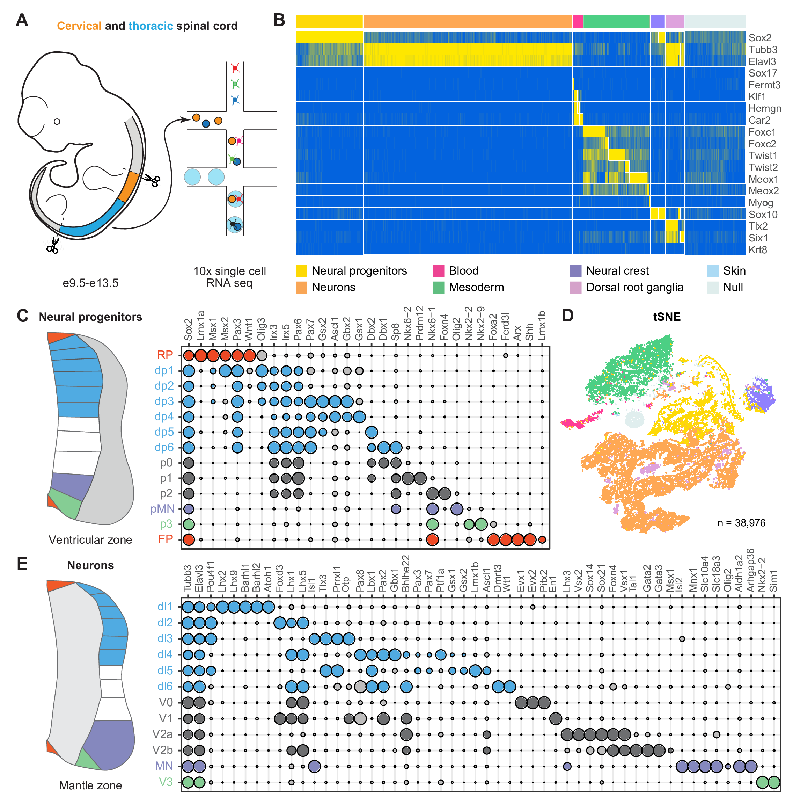
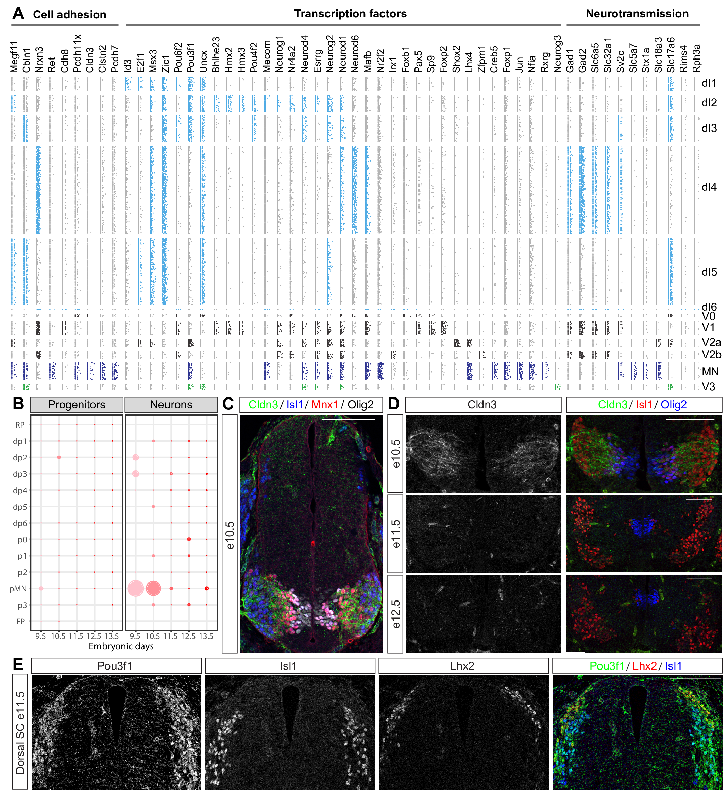
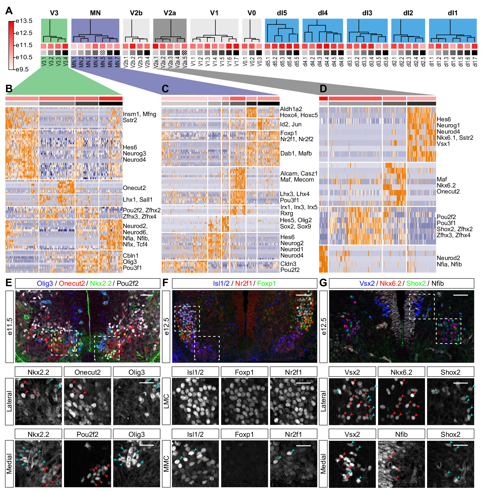
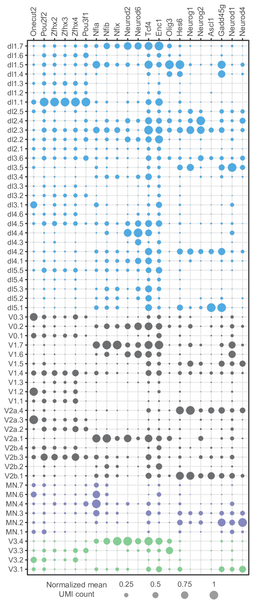
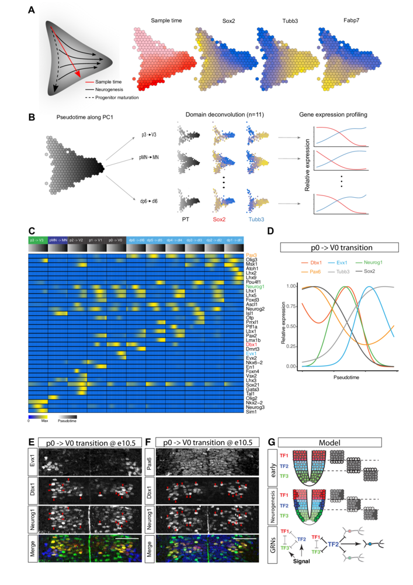
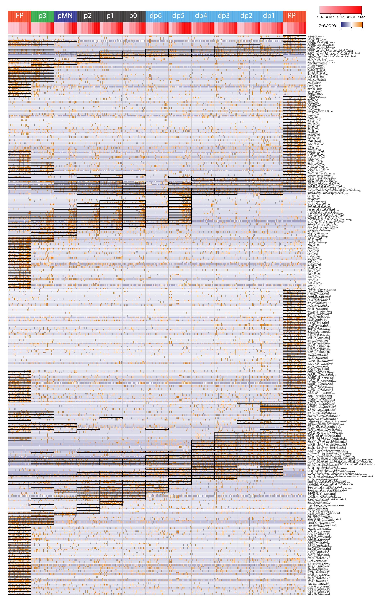
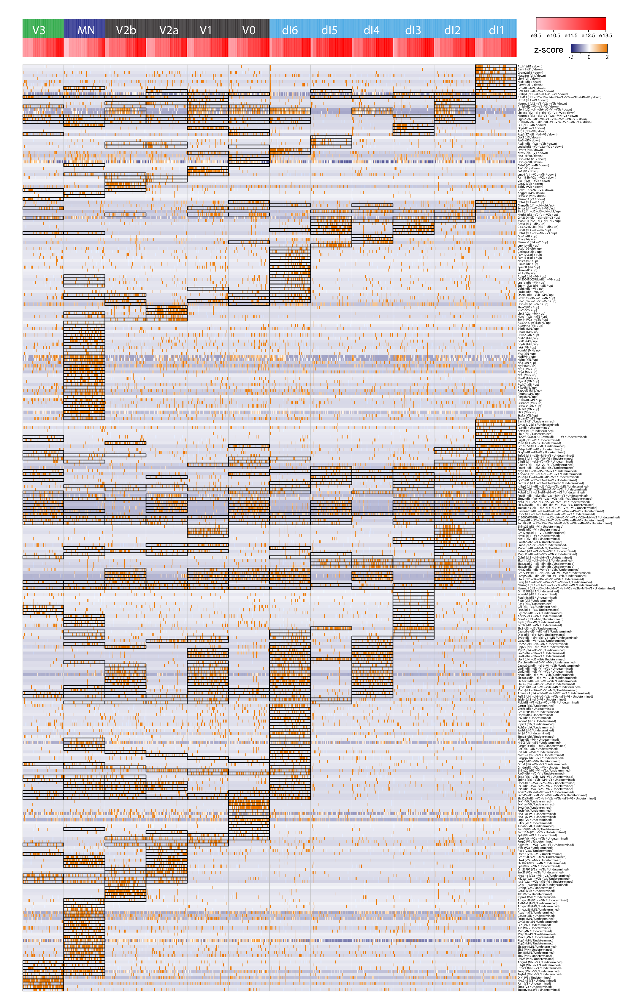
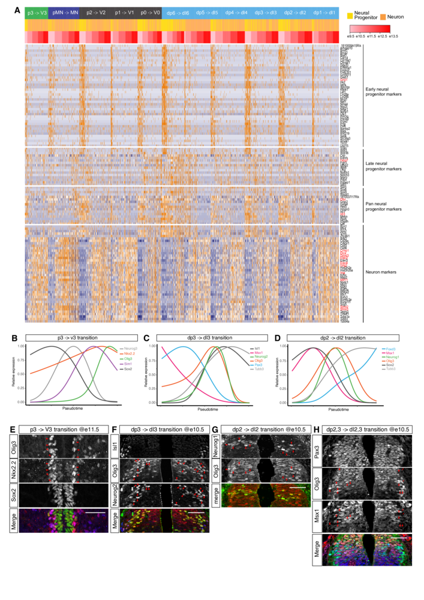

# Mouse Spinal Cord Atlas

<p align="center">


</p>

**DISCLAIMER: This repository is under construction. The code is being
refactored and ***has not been fully tested***. A finalized release will
be available in short order.**

This repository contains the R code used to analyse the single-cell
RNA-seq dataset shown in:

*Delile, J., Rayon, T., Melchionda, M., Edwards, A., Briscoe, J., &
Sagner, A. (2018). Single cell transcriptomics reveals spatial and
temporal dynamics of gene expression in the developing mouse spinal
cord. BioRxiv, 472415. <https://doi.org/10.1101/472415>*

  - [Data availability](#data-availability)
  - [Figure shortcuts](#figure-shortcuts)
  - [Analysis preliminaries](#analysis-preliminaries)
  - [1. Load and hygienize dataset](#1-load-and-hygienize-dataset)
  - [2. Knowledge-based identification of all cell
    populations](#2-knowledge-based-identification-of-all-cell-populations)
  - [3. Population size dynamics](#3-population-size-dynamics)
  - [4. Combinatorial DE tests](#4-combinatorial-de-tests)
  - [5. Neuronal populations
    clustering](#5-neuronal-populations-clustering)
  - [6. Neurogenesis dynamics](#6-neurogenesis-dynamics)

# 

## Data availability

# 

Those interested by processing the dataset independently should consider
downloading the following files:

  - [UMI count
    matrix](https://dl.dropboxusercontent.com/s/ifrdqhea1fs6xuc/assayData.csv)  
  - [Annotated cell
    meta-data](https://github.com/juliendelile/MouseSpinalCordAtlas/raw/master/output/phenoData_annotated.csv)
    indicating the cells’ sample time, replicate id and types as
    determined by the following pipeline. “Type\_step1” and
    “Type\_step2” stands for the 2-step partitioning algorithm
    (Section 2). “Neuron\_subtypes” indicates the result of the
    per-neuronal-type subclustering (Section
5).

# 

## Figure shortcuts

# 

|                               Figure 1                               |                              Figure 2                              |                     Figure 3                     |                Figure 4                 |                        Figure 5                         |
| :------------------------------------------------------------------: | :----------------------------------------------------------------: | :----------------------------------------------: | :-------------------------------------: | :-----------------------------------------------------: |
|                                        |                                      |                    |           |                           |
| [B](#step-1-map) [C](#tsne-plots) [D-E](#progenitor-and-neuron-maps) | [A-D](#population-ratio-dynamics) [E](#population-size-comparison) | [A](#gene-categories-highlights) [B](#claudin-3) | [A](#5-neuronal-populations-clustering) | [A](#gene-levels-per-subtypes) [B](#neurogenesis-waves) |

|                                           Figure 6                                            |                                             Figure S1                                             |               Figure S2                |             Figure S3              |                 Figure S4                 |                                          Figure S5                                           |
| :-------------------------------------------------------------------------------------------: | :-----------------------------------------------------------------------------------------------: | :------------------------------------: | :--------------------------------: | :---------------------------------------: | :------------------------------------------------------------------------------------------: |
|                                                                 |                                                                    |         |     |            |                                                               |
| [A,B](#differentiation-plane) [C](#plot-neurogenesis-pattern) [D](#genes-profiles-per-domain) | [A-C](#1-load-and-hygienize-dataset) [D](#doublet-estimation) [E-F](#tsne-plots) [G](#step-2-map) | [A](#progenitor-patterning-prediction) | [A](#neuron-patterning-prediction) | [A-H](#5-neuronal-populations-clustering) | [A](#identify-gliogenic-and-neurogenic-pan-domain-modules) [B-D](#genes-profiles-per-domain) |

# 

## Analysis Preliminaries

# 

To reproduce the analysis, the files contained in R\_files, input\_files
and dataset must to be downloaded from this repository. The UMI count
matrix is available
[there](https://dl.dropboxusercontent.com/s/ifrdqhea1fs6xuc/assayData.csv)
(DropBox) and should be copied to the dataset folder.

The Antler package is required and can be installed with devtools.

``` r
devtools::install_github("juliendelile/Antler")

library(Antler)
```

Most functions not provided by Antler are stored in
MouseSpinalCordAtlas\_tools.R

``` r
source('./R_files/MouseSpinalCordAtlas_tools.R')
```

The output path can be changed to any existing directory path

``` r
output_path = './output/'
```

# 

## 1\. Load and hygienize dataset

# 

``` r
m = Antler$new(plot_folder=output_path, num_cores=4)

m$loadDataset(folderpath="./dataset/")
```

Annotate gene
names

``` r
m$setCurrentGeneNames(geneID_mapping_file=system.file("extdata", "Annotations/biomart_ensemblid_genename_mmusculus.csv", package="Antler"))
```

Display counts
pre-QC

``` r
m$plotReadcountStats(data_status="Raw", by="timepoint", category="replicate_id", basename="preQC")
```

<p align="center">


</p>

<p align="center">


</p>

Remove cells having more than 6% of mitochondrial UMI counts

``` r
m$removeGenesFromRatio(
                candidate_genes=grep('^mt-', grep('^mt-', m$getGeneNames(), value=T), value=T),
                threshold = 0.06,
                )
```

Remove outliers genes and cells

``` r
m$removeOutliers( lowread_thres = -Inf,
                  highread_thres = Inf,
                  genesmin = 500,
                  cellmin = 3,
                  data_status = 'Raw')
```

Display counts
post-QC

``` r
m$plotReadcountStats(data_status="Raw", by="timepoint", category="replicate_id", basename="postQC")
```

<p align="center">


</p>

<p align="center">


</p>

<p align="center">


</p>

# 

## 2\. Knowledge-based identification of all cell populations

# 

Cell identities are determined by associating each cell to the closest
target population state defined by a list of known marker
genes

``` r
cell_partition = doCellPartition(known_template_file="./input_files/partitioning_table.csv", readcounts=m$getReadcounts(data_status='Raw'))

pop_colors = getPopulationColors(known_template_file="./input_files/partitioning_table.csv")

for(md in c("Type_step1", "Type_step2", "Type_step2_unique", "DV")){pData(m$expressionSet)[[md]] <- cell_partition[[md]]}
```

### Step 1 Map

``` r
cellcluster_sizes_cumsum_step1 = setNames(
          c(0, cumsum(table(pData(m$expressionSet)$Type_step1))),
          c(levels(pData(m$expressionSet)$Type_step1), ""))

m$readcounts_norm=m$readcounts_raw
m$readcounts_norm[m$readcounts_norm >= 2] <- 1 # threshold used in doCellPartition
pop_def_mask_step1 = markersToMask(cell_partition$step1_markers)
m$dR$genemodules = as.list(rownames(pop_def_mask_step1))

m$plotGeneModules(
                  basename='FIG1_Map_Step1',
                  displayed.gms = c('dR.genemodules'),
                  displayed.geneset=NA,
                  use.dendrogram=NA,
                  display.clusters=NULL,
                  file_settings=list(list(type='pdf', width=10, height=5)),
                  data_status=c('Normalized'),
                  gene_transformations='none',
                  display.legend=TRUE,
                  cell.ordering=order(pData(m$expressionSet)$Type_step1), # works iff Type_step1 are factors
                  extra_colors=cbind(
NA
                    "UMI counts"=colorRampPalette(c("white", "black"))(n = 101)[as.integer(1+100*(colSums(m$readcounts_raw) / max(colSums(m$readcounts_raw))))]
                    ),
                  extra_legend=list("text"=c("", levels(pData(m$expressionSet)$Type_step1)), "colors"=c('white', getClusterColors()[seq(length(unique(pData(m$expressionSet)$Type_step1)))])),
                  genemodules.palette=rep("white", length(m$dR$genemodules)),
                  rect_overlay=apply(which(pop_def_mask_step1==1, arr.ind=T), 1, function(x){
                                       list(
                                          xleft=cellcluster_sizes_cumsum_step1[[x[2]]],
                                          xright=cellcluster_sizes_cumsum_step1[[x[2]+1]],
                                          ytop=length(unlist(m$dR$genemodules)) - x[1] + 0.5,
                                          ybottom=length(unlist(m$dR$genemodules)) - x[1]+1 + 0.5
                                          )
                                  }),
                  pretty.params=list("size_factor"=3, "ngenes_per_lines" = 8, "side.height.fraction"=.3),
                  curr_plot_folder=output_path
                )
```

<a href="./suppl_files/FIG1_Map_Step1_dR.genemodules_Normalized_none.pdf">Download
PDF</a>

<p align="center">


</p>

### Step 2 Map

``` r
cellcluster_sizes_cumsum_step2 = setNames(
          c(0, cumsum(table(pData(m$expressionSet)$Type_step2_unique))),
          c(levels(pData(m$expressionSet)$Type_step2_unique), ""))

bothSteps_mask = markersToMask(cell_partition$bothSteps_markers)
m$dR$genemodules = as.list(rownames(bothSteps_mask))

m$plotGeneModules(
                  basename='FIGS1_Map_Step2',
                  displayed.gms = c('dR.genemodules'),
                  displayed.geneset=NA, # NA, plot all genes
                  use.dendrogram=NA,
                  display.clusters=NULL, #"State",
                  file_settings=list(list(type='pdf', width=10, height=8)),
                  data_status=c('Raw'),
                  gene_transformations='logscaled',
                  display.legend=TRUE,
                  cell.ordering=order(pData(m$expressionSet)$Type_step2_unique),
                  extra_colors=cbind(
                    "Step 1 Type"=pop_colors$Step1[as.character(pData(m$expressionSet)$Type_step1)],
                    "Step 2 Type"=pop_colors$Step2[as.character(pData(m$expressionSet)$Type_step2)]
                    ),
                  extra_legend=list("text"=c("", levels(pData(m$expressionSet)$Type_step2)), "colors"=c('white', getClusterColors()[seq(length(unique(pData(m$expressionSet)$Type_step2)))])),
                  rect_overlay=apply(which(bothSteps_mask==1, arr.ind=T), 1, function(x){
                                       list(
                                          xleft=cellcluster_sizes_cumsum_step2[[x[2]]],
                                          xright=cellcluster_sizes_cumsum_step2[[x[2]+1]],
                                          ytop=length(unlist(m$dR$genemodules)) - x[1] + 0.5,
                                          ybottom=length(unlist(m$dR$genemodules)) - x[1]+1 + 0.5
                                          )
                                  }),
                  pretty.params=list("size_factor"=3, "ngenes_per_lines" = 8, "side.height.fraction"=.3),
                  curr_plot_folder=output_path
                  )
```

<a href="./suppl_files/FIGS1_Map_Step2_dR.genemodules_Raw_logscaled.pdf">Download
PDF</a>

<p align="center">


</p>

### Doublet estimation

Estimate quantity of cell doublets by calculating the ratio of the
expressed cell type markers in other populations

``` r
dcounts = estimateDoublets()

write.csv(dcounts, file=paste0(output_path, "/FIGS1_doublet_estimates.csv"))
```

<a href="./suppl_files/FIGS1_doublet_estimates.csv">Download doublet
estimates</a>

Export markers to
csv

``` r
write.table(markersToMask(cell_partition$step2_markers) %>% cbind("Gene"=rownames(.), .), file=paste0(output_path,'/Table_S1.csv'), row.names=F, sep=";", quote=FALSE)
```

Select and create structures for 1. neural cells, 2. neuronal
progenitors and 3. Neurons

``` r
# 1. Neural cells
m_neural = m$copy()
m_neural$excludeCellsFromIds(which(!pData(m_neural$expressionSet)$Type_step1 %in% c('Progenitor', 'Neuron')))
m_neural$excludeCellsFromIds(which(pData(m_neural$expressionSet)$Type_step2 %in% c('Null_Progenitor', 'Null_Neuron')))
m_neural$excludeUnexpressedGenes(min.cells=1, min.level=1, verbose=TRUE, data_status="Raw")
pData(m_neural$expressionSet)$Type_step1 = factor(pData(m_neural$expressionSet)$Type_step1, levels=levels(droplevels(pData(m_neural$expressionSet)$Type_step1)))
pData(m_neural$expressionSet)$Type_step2 = factor(pData(m_neural$expressionSet)$Type_step2, levels=levels(droplevels(pData(m_neural$expressionSet)$Type_step2)))
pData(m_neural$expressionSet)$Type_step2_unique = factor(pData(m_neural$expressionSet)$Type_step2_unique, levels=levels(droplevels(pData(m_neural$expressionSet)$Type_step2_unique)))

# 2. Neuronal progenitors
m_prog = m_neural$copy()
m_prog$excludeCellsFromIds(which(!pData(m_prog$expressionSet)$Type_step1 == 'Progenitor'))
m_prog$excludeUnexpressedGenes(min.cells=1, min.level=1, verbose=TRUE, data_status="Raw")
pData(m_prog$expressionSet)$Type_step1 = factor(pData(m_prog$expressionSet)$Type_step1, levels=levels(droplevels(pData(m_prog$expressionSet)$Type_step1)))
pData(m_prog$expressionSet)$Type_step2 = factor(pData(m_prog$expressionSet)$Type_step2, levels=levels(droplevels(pData(m_prog$expressionSet)$Type_step2)))
m_prog$dR$genemodules = as.list(unique(unlist(cell_partition$bothSteps_markers_neural[levels(droplevels(pData(m_prog$expressionSet)$Type_step2))])))

# 3. Neurons
m_neuron = m_neural$copy()
m_neuron$excludeCellsFromIds(which(!pData(m_neuron$expressionSet)$Type_step1 == 'Neuron'))
m_neuron$excludeUnexpressedGenes(min.cells=1, min.level=1, verbose=TRUE, data_status="Raw")
pData(m_neuron$expressionSet)$Type_step1 = factor(pData(m_neuron$expressionSet)$Type_step1, levels=levels(droplevels(pData(m_neuron$expressionSet)$Type_step1)))
pData(m_neuron$expressionSet)$Type_step2 = factor(pData(m_neuron$expressionSet)$Type_step2, levels=levels(droplevels(pData(m_neuron$expressionSet)$Type_step2)))
m_neuron$dR$genemodules = as.list(unique(unlist(cell_partition$bothSteps_markers_neural[levels(droplevels(pData(m_neuron$expressionSet)$Type_step2))])))

# Save structures to file
saveRDS(m_neural, file=paste0(output_path, '/m_neural.rds'))
# m_neural=readRDS(paste0(output_path, '/m_neural.rds'))
saveRDS(m_neuron, file=paste0(output_path, '/m_neuron.rds'))
# m_neuron=readRDS(paste0(output_path, '/m_neuron.rds'))
saveRDS(m_prog, file=paste0(output_path, '/m_prog.rds'))
# m_prog=readRDS(paste0(output_path, '/m_prog.rds'))
saveRDS(m, file=paste0(output_path, '/m_typed.rds'))
# m = readRDS(paste0(output_path, '/m_typed.rds'))
```

### Progenitor and Neuron Maps

``` r
bubble_chart.df = data.frame(t(m_neural$getReadcounts('Raw')[unique(unlist(cell_partition$bothSteps_markers_neural)), ]), check.names=F) %>%
      tibble::rownames_to_column('cellname') %>% 
      tidyr::gather(genename, value, -cellname) %>%
      # dplyr::mutate(genename=factor(genename, levels=rev(unique(unlist(cell_partition$bothSteps_markers_neural))))) %>%
      dplyr::mutate(genename=factor(genename, levels=(unique(unlist(cell_partition$bothSteps_markers_neural))))) %>%
      dplyr::left_join(pData(m_neural$expressionSet) %>% tibble::rownames_to_column("cellname"), by="cellname") %>%
      dplyr::group_by(Type_step2, genename) %>%
      dplyr::summarise(mean=mean(value)) %>% 
      dplyr::group_by(genename) %>%
      dplyr::mutate(mean_norm_max=mean/max(mean), 
                    Type_step2 = factor(Type_step2, levels=rev(levels(Type_step2)))) %>%
      dplyr::ungroup() %>%
      dplyr::mutate(partitionning=factor((function(x,y){unlist(lapply(seq(length(x)), function(i){markersToMask(cell_partition$bothSteps_markers_neural)[x[[i]],y[i]]}))})(as.character(genename), as.character(Type_step2)), levels=c(0,1)))

focus_red = "#D63624"
unfocus_grey = "grey"

pdf(paste0(output_path, '/FIG1_Progenitors_bubble_chart.pdf'), height=3.5, width=7, useDingbats=FALSE)
p <- ggplot(bubble_chart.df %>% dplyr::filter(Type_step2 %in% levels(droplevels(pData(m_prog$expressionSet)$Type_step2)), genename %in% unlist(m_prog$dR$genemodules))) +
 geom_count(aes(x=genename, y=Type_step2, size=mean_norm_max, fill=partitionning), color="black", shape=21) + scale_size_area(max_size=5) + scale_fill_manual(breaks=c(0,1), values=c(unfocus_grey, focus_red)) + scale_x_discrete(position = "top") + xlab("") + ylab("") + theme_bw() + theme(axis.text.x = element_text(angle = 45, hjust = 0)) 
print(p)
graphics.off()
```

<a href="./suppl_files/FIG1_Progenitors_bubble_chart.pdf">Download
PDF</a>

<p align="center">


</p>

``` r
pdf(paste0(output_path, '/FIG1_Neurons_bubble_chart.pdf'), height=3.5, width=10, useDingbats=FALSE)
p <- bubble_chart.df %>%
          dplyr::filter(Type_step2 %in% levels(droplevels(pData(m_neuron$expressionSet)$Type_step2)), genename %in% unlist(m_neuron$dR$genemodules)) %>%
          dplyr::mutate(genename=factor(genename, levels=unique(unlist(cell_partition$bothSteps_markers_neural[levels(droplevels(pData(m_neuron$expressionSet)$Type_step2))])))) %>%
  ggplot(.) + geom_count(aes(x=genename, y=Type_step2, size=mean_norm_max, fill=partitionning), color="black", shape=21) + scale_size_area(max_size=5) + scale_fill_manual(breaks=c(0,1), values=c(unfocus_grey, focus_red)) + scale_x_discrete(position = "top") + xlab("") + ylab("") + theme_bw() + theme(axis.text.x = element_text(angle = 45, hjust = 0)) 
print(p)
graphics.off()
```

<a href="./suppl_files/FIG1_Neurons_bubble_chart.pdf">Download PDF</a>

<p align="center">


</p>

### tSNE plots

tSNE computation takes about 30min, skip to next section if the code has
already run once.

``` r
m$normalize("geometric_mean_sizeFactors")
step1.tsne.data = m$getReadcounts('Normalized')[unique(unlist(cell_partition$step1_markers)), ]
set.seed(1)
t0=Sys.time()
step1.tsne.coords = Rtsne::Rtsne(t(step1.tsne.data), pca=FALSE, perplexity=100, max_iter=2000, verbose=T, check_duplicates = FALSE)$Y
print(Sys.time()-t0)
saveRDS(step1.tsne.coords, file=paste0(output_path, '/step1.tsne.coords.rds'))
```

Load pre calculated tsne
coordinates

``` r
step1.tsne.coords = readRDS(paste0(output_path, '/step1.tsne.coords.rds'))

png(paste0(output_path, '/FIG1_Map_Step1_tSNE_Normalized_Types.png'), width=4000, height=4000, pointsize=75)

op <- par(mfrow = c(1,1),
          oma = c(5,4,0,0) + 0.1,
          mar = c(0,0,1,1) + 0.1)

vertex.plot.order = rev(order(pData(m$expressionSet)$Type_step1))
plot(step1.tsne.coords[vertex.plot.order,], , col=pop_colors$Step1[as.character(pData(m$expressionSet)$Type_step1)][vertex.plot.order], pch=16, cex=.7, main='Step 1 Types', xlab = "", ylab = "", xaxt='n', yaxt='n', bty = "n")

par(op)
par(fig = c(0, 1, 0, 1), oma = c(0, 0, 0, 0), mar = c(0, 0, 0, 0), new = TRUE)
plot(0, 0, type = "n", bty = "n", xaxt = "n", yaxt = "n")
legend(x="left", 
  legend=names(pop_colors$Step1),
  col=pop_colors$Step1,
  pch=15,  
  y.intersp = 1.2, cex=.8,
  bg='transparent',
  box.col='transparent'
    )

graphics.off()
```

<p align="center">


</p>

Progenitor only / Neuron
only

``` r
png(paste0(output_path, '/FIG1_Map_Step1_tSNE_Normalized_Progenitor_Focus.png'), width=2000, height=2000, pointsize=40)
plot(step1.tsne.coords, col=ifelse(pData(m$expressionSet)$Type_step1=="Progenitor", "#D63624", "grey"), pch=16, cex=.7, main='Progenitors', xlab = "", ylab = "", xaxt='n', yaxt='n', bty = "n")
graphics.off()
```

<p align="center">


</p>

``` r
png(paste0(output_path, '/FIG1_Map_Step1_tSNE_Normalized_Neuron_Focus.png'), width=2000, height=2000, pointsize=40)
plot(step1.tsne.coords, col=ifelse(pData(m$expressionSet)$Type_step1=="Neuron", "#D63624", "grey"), pch=16, cex=.7, main='Neurons', xlab = "", ylab = "", xaxt='n', yaxt='n', bty = "n")
graphics.off()
```

<p align="center">


</p>

Replicate per timepoint plots

``` r
# relabel replicate id to remove gaps

rep_colors = RColorBrewer::brewer.pal(9, "Set1")[1:3]

for(tp in unique(pData(m$expressionSet)$timepoint)) {

  rep_ids = unique(pData(m$expressionSet)$replicate_id[pData(m$expressionSet)$timepoint==tp])

  cell_colors = ifelse(
        pData(m$expressionSet)$timepoint != tp,
        'grey',
        rep_colors[pData(m$expressionSet)$replicate_id]
        )

  tp_cell_ids = sample(which((m$expressionSet)$timepoint == tp))

  vertex.plot.order=c(setdiff(seq(m$getNumberOfCells()), tp_cell_ids), tp_cell_ids)

  png(paste0(output_path, '/FIG1SUPP_Map_Step1_tSNE_Normalized_ReplicateIDs_', tp, '.png'), width=2000, height=2000, pointsize=40)
  plot(step1.tsne.coords[vertex.plot.order, ], col=cell_colors[vertex.plot.order], pch=16, cex=.7, main=paste0('Replicates E', tp, ' (n=', length(rep_ids), ')'), xlab = "", ylab = "", xaxt='n', yaxt='n', bty = "n")
  graphics.off()

}
```

<p align="center">


</p>

<p align="center">


</p>

<p align="center">


</p>

<p align="center">


</p>

<p align="center">


</p>

Plot
Sex

``` r
sex.df=cbind.data.frame(Xist=m$getReadcounts('Raw')['Xist',], pData(m$expressionSet)) %>%
      dplyr::group_by(replicate_id, timepoint) %>%
      dplyr::summarize(Xist_mean=mean(Xist)) %>%
      dplyr::mutate(Sex=ifelse(Xist_mean < 1, "Male", "Female")) %>%
      dplyr::arrange(timepoint)

cell_sex = pData(m$expressionSet) %>%
      dplyr::select(replicate_id, timepoint) %>%
      dplyr::left_join(sex.df, by=c("timepoint"="timepoint", "replicate_id"="replicate_id")) %>%
      .$Sex

sex_colors = c("Male"="cornflowerblue", "Female"="coral1")

png(paste0(output_path, '/FIG1SUPP_Map_Step1_tSNE_Normalized_Sex.png'), width=2000, height=2000, pointsize=40)
plot(step1.tsne.coords, col=sex_colors[cell_sex], pch=16, cex=.4, main='Sex', xlab = "", ylab = "", xaxt='n', yaxt='n', bty = "n")
graphics.off()
```

<p align="center">


</p>

# 

## 3\. Population size dynamics

# 

### Population ratio dynamics

``` r
count.df = pData(m_neural$expressionSet) %>%
        dplyr::select(timepoint, Type_step1, Type_step2) %>%
        dplyr::mutate(
            timepoint=factor(timepoint, levels=sort(unique(timepoint))),
            Type_step1=factor(Type_step1, levels=levels(droplevels(Type_step1))),
            Type_step2=factor(Type_step2, levels=levels(droplevels(Type_step2))),
          ) %>%
        dplyr::group_by(timepoint, Type_step1, Type_step2) %>%
        dplyr::tally()  %>%
        dplyr::group_by(timepoint) %>%
        dplyr::add_tally()  %>%
        dplyr::mutate(freq_norm=n/nn) %>%
        dplyr::group_by(timepoint, Type_step1) %>%
        dplyr::add_tally() %>%
        dplyr::mutate(freq_norm_type=n/nnn) %>%
        dplyr::ungroup()
```

Display population size
dynamics

``` r
p2 <- ggplot(count.df[which(count.df$Type_step1=="Progenitor"),], aes(x=timepoint, y=freq_norm, fill=Type_step2, group=interaction(Type_step2, Type_step1))) + geom_area() + ggtitle("Progenitors") + ylab("") + xlab('') + theme(legend.position="none") + scale_fill_manual(breaks=levels(count.df$Type_step2), values=pop_colors$Step2[levels(count.df$Type_step2)], drop=F) + theme_minimal() + theme(legend.position="none")

p3 <- ggplot(count.df[which(count.df$Type_step1=="Neuron"),], aes(x=timepoint, y=freq_norm, fill=Type_step2, group=interaction(Type_step2, Type_step1))) + geom_area() + ggtitle("Neurons") + ylab("") + xlab('') + scale_fill_manual(breaks=levels(count.df$Type_step2), values=pop_colors$Step2[levels(count.df$Type_step2)], drop=F) + theme_classic() + theme_minimal() + theme(legend.position="none")

p4 <- ggplot(count.df[which(count.df$Type_step1=="Progenitor"),], aes(x=timepoint, y=freq_norm_type, fill=Type_step2, group=interaction(Type_step2, Type_step1))) + geom_area() + ggtitle("Progenitor Ratios") + ylab("") + xlab('') + scale_fill_manual(breaks=levels(count.df$Type_step2), values=pop_colors$Step2[levels(count.df$Type_step2)], drop=F) + theme_minimal() + theme(legend.position="none")

p5 <- ggplot(count.df[which(count.df$Type_step1=="Neuron"),], aes(x=timepoint, y=freq_norm_type, fill=Type_step2, group=interaction(Type_step2, Type_step1))) + geom_area() + ggtitle("Neuron Ratios") + ylab("") + xlab('') + scale_fill_manual(breaks=levels(count.df$Type_step2), values=pop_colors$Step2[levels(count.df$Type_step2)], drop=F) + theme_minimal() + theme(legend.position="none")

p1 <- ggplot(count.df[which(count.df$Type_step1 %in% c("Progenitor", "Neuron")),], aes(x=timepoint, y=freq_norm, fill=Type_step2, group=interaction(Type_step1, Type_step2), alpha=Type_step1)) + geom_area(color='black', size=.05) + ggtitle("Neural Ratios") + ylab("") + xlab('') + scale_fill_manual(breaks=levels(count.df$Type_step2), values=pop_colors$Step2[levels(count.df$Type_step2)], drop=F) + scale_alpha_manual(breaks=c("Progenitor", "Neuron"), values=c(0.5, 1)) + theme(legend.key.width=unit(0.15,"cm"), legend.key.height=unit(0.15,"cm"), legend.position = c(0.6, 0.6)) + guides(fill=guide_legend(ncol=3))
# print(p1)
# graphics.off()

g_legend <- function(a.gplot){
  pdf(file=NULL)
  tmp <- ggplot_gtable(ggplot_build(a.gplot))
  graphics.off()
  leg <- which(sapply(tmp$grobs, function(x) x$name) == "guide-box")
  legend <- tmp$grobs[[leg]]
  return(legend)}

lgd <- g_legend(p1)


pdf(paste0(output_path, 'FIG2_DV_Population_Ratios.pdf'), width=7, height=4, useDingbats=FALSE)
gridExtra::grid.arrange(grobs=list(p1 + theme(legend.position="none"),p2,p3,lgd,p4,p5), layout_matrix=matrix(seq(6), ncol=3, byrow=T))
graphics.off()
```

<a href="./suppl_files/FIG2_DV_Population_Ratios.pdf">Download PDF</a>

<p align="center">


</p>

### Population size comparison

Comparison with Kicheva et al.,
2014

``` r
kicheva_vals = read.table(file='./input_files/kicheva2014_Fig1G.csv', sep='\t', stringsAsFactors=F, header=FALSE, skipNul=T)
colnames(kicheva_vals) <- kicheva_vals[1,]
kicheva_vals <- kicheva_vals[-1,]

kicheva_vals <- kicheva_vals %>%
                    dplyr::filter(Type %in% c("average", "sd")) %>%
                    tidyr::gather(Timepoint, value, -Type, -Domain) %>%
                    dplyr::group_by(Timepoint) %>%
                    dplyr::mutate(value=value/max(value, na.rm=T)) %>% # works because max is always a mean value, not a sd
                    dplyr::ungroup() %>%
                    dplyr::mutate(dataset="Kicheva et al., 2014", Timepoint=as.numeric(Timepoint)) %>%
                    dplyr::filter(Domain != "total") %>%
                    tidyr::spread(Type, value)

baseline=90

both_dataset.df = count.df %>%
          dplyr::filter(Type_step1=="Progenitor" & Type_step2 %in% levels(pData(m_prog$expressionSet)$Type_step2)) %>%
          dplyr::filter(!Type_step2 %in% c(NULL, "RP")) %>%
          dplyr::select(timepoint, Type_step2, freq_norm_type) %>%
          dplyr::rowwise() %>%
          dplyr::mutate(
                # Timepoint=switch(as.numeric(timepoint), "E9.5"=60, "10.5"=80, "11.5"=100),  # James email values
                Timepoint=switch(as.numeric(timepoint), "E9.5"=baseline-48, "10.5"=baseline-24, "11.5"=baseline, "12.5"=baseline+24, "13.5"=baseline+48),   # extrapolated from manuscript (E11.5 ~ 90hph)
                Domain=switch(as.character(Type_step2), "FP"="FP", "p3"="p3", "pMN"="pMN", "p2"="pI", "p1"="pI", "p0"="pI", "dp6"="pD", "dp5"="pD", "dp4"="pD", "dp3"="pD", "dp2"="pD", "dp1"="pD"),
                average=freq_norm_type,
                sd=NA,
                dataset="scRNA-seq"
                ) %>%
          dplyr::ungroup() %>%
          dplyr::group_by(Domain, Timepoint) %>%
          dplyr::summarise(average=sum(average), dataset=unique(dataset)) %>%
          dplyr::bind_rows(kicheva_vals) %>%
          dplyr::mutate(dataset=factor(dataset, levels=c('scRNA-seq', 'Kicheva et al., 2014')))

p <- ggplot(both_dataset.df) +
      geom_line(aes(x=Timepoint, y=average, color=Domain, linetype=dataset, group=interaction(dataset, Domain)), size=.2) +
      geom_point(aes(x=Timepoint, y=average, color=Domain), size=.5) +
      geom_errorbar(aes(x=Timepoint, ymin=average-sd, ymax=average+sd, color=Domain, linetype=dataset)) +
      xlab("Time (hph)") + ylab("Progenitors (fraction)") + xlim(0,150) + 
      scale_colour_manual(breaks=c("FP", "p3", "pMN", "pI", "pD"), values=c("#B2AED6", "#82B383", "#F59498", "#D4D4D4", "#A7C7D7")) + 
      theme_minimal()

pdf(paste0(output_path, 'FIG2_DV_Population_Ratios_Comparison_Kicheva.pdf'), width=7, height=4, useDingbats=FALSE)
print(p)
graphics.off()
```

<a href="./suppl_files/FIG2_DV_Population_Ratios_Comparison_Kicheva.pdf">Download
PDF</a>

<p align="center">


</p>

# 

## 4\. Combinatorial DE tests

# 

### Neuron patterning prediction

Resample dataset and select populations

``` r
m_neuron_combDE = resampleDataForCombinationDE(
              orig_m_neural_path = paste0(output_path, '/m_neural.rds'),
              num_min_cells_per_type2 = 40, # remove cell types with less than X cells
              selected_type1 = "Neuron", # "Both", "Neuron", "Progenitor"
              sampling_categories = c('Type_step2'),
              num_cells_per_category = 200,  # number of cells sampled per timepoint X Type_step2
              dispersion_prefiltering_zscore = 0 # NULL, pre_select genes with sufficient dispersion score
              )

neuron_partitionning_genes = unique(unlist(cell_partition$step2_markers[levels(pData(m_neuron_combDE$expressionSet)$Type_step2)]))
```

Pre-select type patterned genes

``` r
neuron_patterned_genes_test = m_neuron_combDE$runMonocle2DETest(
                    fullModelFormulaStr="~Type_step2",
                    reducedModelFormulaStr = "~1",
                    expressionFamily=VGAM::negbinomial.size()
                    )

neuron_patterned_genes = neuron_patterned_genes_test %>% as_tibble %>% dplyr::arrange(qval) %>% dplyr::filter(qval < 1e-5) %>% .$gene_short_name %>% as.character

neuron_partitionning_genes %>% {length(intersect(., neuron_patterned_genes))/length(.)} %>% {sprintf("%.2f%% of the markers used to partition neurons are included in the patterned gene list", .*100)}

m_neuron_combDE$excludeGenesFromIds(which(!m_neuron_combDE$getGeneNames() %in% neuron_patterned_genes))
```

Generate tested models

``` r
neuronCombinatorialModels = generateCombinatorialModels(m_neuron_combDE)
```

Run tests (4h45 with 8
cores)

``` r
Monocle_run_neuron = runCombinatorialDETests(m_neuron_combDE, neuronCombinatorialModels, numcores=8)

save(Monocle_run_neuron, file=paste0(output_path,'/Monocle_run_neuron_NegBinFamilyResample'))
# load(paste0(output_path,'/Monocle_run_neuron_NegBinFamilyResample.Rdata'))
```

Filter best model, for each
gene

``` r
Monocle_run_neuron_topModel = getTopModel(m_neuron_combDE, Monocle_run_neuron, temporal_pattern_thres=.2)

saveRDS(Monocle_run_neuron_topModel, file=paste0(output_path, '/Monocle_run_neuron_topModel.rds'))
# Monocle_run_neuron_topModel = readRDS(file=paste0(output_path, '/Monocle_run_neuron_topModel.rds'))
```

Add additional measures and filter models (fold change, average level,
time correlation…)

``` r
pval_thres_neuron = 1e-9

neuron_models_annotations = getModelAnnotations(m_neuron_combDE, model_list=unique(Monocle_run_neuron_topModel$model))

m_neuron_combDE$dR$genemodules = makeGeneModules(Monocle_run_neuron_topModel, neuron_models_annotations,
                                          pval_thres = pval_thres_neuron, pos_pop_level_threshold = .15,
                                          pos_pop_ratio_threshold = .08, log2fc_thres = 2,
                                          gm_grouping_vars = c("model", "temporal_pattern"),
                                          gm_ordering_vars = c("temporal_pattern", "first_domain_factor", "num_domain")
                                          )
length(unlist(m_neuron_combDE$dR$genemodules))
setdiff(neuron_partitionning_genes, unlist(m_neuron_combDE$dR$genemodules))

print(paste0("Number of neuronal categories: ", length(which(unlist(lapply(m_neuron_combDE$dR$genemodules, length)) > 0))))

saveRDS(m_neuron_combDE$dR$genemodules, file=paste0(output_path, '/neurons_combDE_genelists.rds'))
save.image(paste0(output_path, '/workspace_postCombDE_neurons.Rdata'))

# For figure 3A, we do not use temporal pattern categories
gms.ordered = makeGeneModules(Monocle_run_neuron_topModel, neuron_models_annotations,
                                          pval_thres = pval_thres_neuron, pos_pop_level_threshold = .15,
                                          pos_pop_ratio_threshold = .08, log2fc_thres = 2,
                                          gm_grouping_vars = c("model"),
                                          gm_ordering_vars = c("first_domain_factor", "num_domain")
                                          )
saveRDS(gms.ordered, file=paste0(output_path, '/neurons_combDE_genelists_ordered.rds'))
```

Plot predicted genes

``` r
neuron_combDE_by_domain = list()
for(x in setdiff(names(m_neuron_combDE$dR$genemodules), "Missing")) {
  for(p in strsplit(strsplit(x, " / ")[[1]][1], '-')[[1]]) {
    neuron_combDE_by_domain[[p]] <- c(neuron_combDE_by_domain[[p]], m_neuron_combDE$dR$genemodules[[x]])
  }
}
neuron_combDE_by_domain_mask = markersToMask(neuron_combDE_by_domain[rev(levels(pData(m_neuron_combDE$expressionSet)$Type_step2))])[unlist(m_neuron_combDE$dR$genemodules),]

gene_pValues =  (Monocle_run_neuron_topModel %>% {"names<-"(.$pval, .$genename)})[unlist(m_neuron_combDE$dR$genemodules)]
gene_pValues_colors = colorRampPalette(c("white", "black"))(n = 10)[cut(log10(1e-100 + gene_pValues), 10)]
gene_pValues_colors[which(gene_pValues == 0)] <- "orange"

cellcluster_sizes_combDE = table(pData(m_neuron_combDE$expressionSet)$Type_step2)
cellcluster_sizes_cumsum_neuron_combDE = c(0, cumsum(cellcluster_sizes_combDE))
names(cellcluster_sizes_cumsum_neuron_combDE) <- c(names(cellcluster_sizes_combDE), "")

tf_list = getTFs()

interesting_genes = sort(setdiff(unlist(m_neuron_combDE$dR$genemodules), sort(unique(unlist(cell_partition$bothSteps_markers_neural)))))

plot_basename_neuron = paste0('FIG3SUPP_Neural_DE_Combinatorial_Neurons_NegBinResampled')

m_neuron_combDE$plotGeneModules(
              basename=plot_basename_neuron,
              displayed.gms = c('dR.genemodules'),
              displayed.geneset=NA, # plot all genes
              use.dendrogram=NA,
              display.clusters=NULL, #"State",
              # file_settings=list(list(type='png', width=1500, height=4000)),
              file_settings=list(list(type='pdf', width=7, height=as.integer(0.01*length(unlist(m_neuron_combDE$dR$genemodules)) + 6))),
              data_status='Raw',
              gene_transformations=c('log', 'logscaled'),
              display.legend=TRUE,
              cell.ordering=order(rev(pData(m_neuron_combDE$expressionSet)$Type_step2), pData(m_neuron_combDE$expressionSet)$timepoint),
              extra_colors=cbind(
                "Neural types"=pop_colors$Step2[as.character(pData(m_neuron_combDE$expressionSet)$Type_step2)],
                "timepoint"=pop_colors$timepoint[as.character(pData(m_neuron_combDE$expressionSet)$timepoint)]
                ),
              genemodules.palette=rep(c("gray80", "gray90"), length(m_neuron_combDE$dR$genemodules)), 
              genes.extra_colors=cbind(
                  "Partitionning"=unname(unlist(lapply(unlist(m_neuron_combDE$dR$genemodules), function(l) if(l %in% neuron_partitionning_genes) 'red' else 'white'))),
                  "pval"=gene_pValues_colors,
                  "TF"=unname(unlist(lapply(unlist(m_neuron_combDE$dR$genemodules), function(l) if(l %in% tf_list) 'yellow' else 'white'))),
                  "Time behavior"=c("blue", "red", "white")[(Monocle_run_neuron_topModel %>% {"names<-"(.$temporal_pattern, .$genename)}) [unlist(m_neuron_combDE$dR$genemodules)]],
                  "+"=unname(unlist(lapply(unlist(m_neuron_combDE$dR$genemodules), function(l) if(l %in% interesting_genes) 'green' else 'white')))
                  ),
              extra_legend=list("text"=c("", levels(droplevels(pData(m_neuron_combDE$expressionSet)$Type_step2))), "colors"=c('white', getClusterColors()[seq(length(unique(pData(m_neuron_combDE$expressionSet)$Type_step2)))])),
              rect_overlay=c(lapply(seq(rev(levels(pData(m_neuron_combDE$expressionSet)$Type_step2))), function(i){
                                      list(
                                        xleft=cellcluster_sizes_cumsum_neuron_combDE[[i]],
                                        xright=cellcluster_sizes_cumsum_neuron_combDE[[i+1]],
                                        ytop=0.5,
                                        ybottom=length(unlist(m_neuron_combDE$dR$genemodules)) + 0.5,
                                        width=.2,
                                        color="grey"
                                        )
                                    }),
                            apply(which(neuron_combDE_by_domain_mask==1, arr.ind=T), 1, function(x){
                                       list(
                                          xleft=cellcluster_sizes_cumsum_neuron_combDE[[x[2]]],
                                          xright=cellcluster_sizes_cumsum_neuron_combDE[[x[2]+1]],
                                          ytop=length(unlist(m_neuron_combDE$dR$genemodules)) - x[1] + 0.5,
                                          ybottom=length(unlist(m_neuron_combDE$dR$genemodules)) - x[1]+1 + 0.5,
                                          color='black'
                                          )
                                  })
                          ),
              pretty.params=list("size_factor"=1, "ngenes_per_lines" = 8, "side.height.fraction"=.3),
              curr_plot_folder=output_path
            )
```

<a href="./suppl_files/FIG3SUPP_Neural_DE_Combinatorial_Neurons_NegBinResampled_dR.genemodules_Raw_logscaled.pdf">Download
PDF</a>

<p align="center">


</p>

Export predicted genes to
file

``` r
m_neuron_combDE$writeGeneModules(basename=plot_basename_neuron, gms='dR.genemodules')
```

<a href="./suppl_files/FIG3SUPP_Neural_DE_Combinatorial_Neurons_NegBinResampled_dR.genemodules.txt">Download
predicted genes</a>

### Progenitor patterning prediction

Resample dataset and select populations

``` r
m_prog_combDE = resampleDataForCombinationDE(
              orig_m_neural_path = paste0(output_path, '/m_neural.rds'),
              num_min_cells_per_type2 = 40, # remove cell types with less than X cells
              selected_type1 = "Progenitor", # "Both", "Neuron", "Progenitor"
              sampling_categories = c('Type_step2'),
              num_cells_per_category = 200,  # number of cells sampled per timepoint X Type_step2
              dispersion_prefiltering_zscore = NULL # 0, pre_select genes with sufficient dispersion score
              )

prog_partitionning_genes = unique(unlist(cell_partition$step2_markers[levels(pData(m_prog_combDE$expressionSet)$Type_step2)]))
```

Pre-select type patterned genes

``` r
prog_patterned_genes_test = m_prog_combDE$runMonocle2DETest(
                    fullModelFormulaStr="~Type_step2",
                    reducedModelFormulaStr = "~1",
                    expressionFamily=VGAM::negbinomial.size()
                    )

prog_patterned_genes = prog_patterned_genes_test %>% as_tibble %>% dplyr::arrange(qval) %>% dplyr::filter(qval < 1e-5) %>% .$gene_short_name %>% as.character

prog_partitionning_genes %>% {length(intersect(., prog_patterned_genes)) / length(.)} %>% {sprintf("%.2f%% of the markers used to partition progenitors are included in the patterned gene list", .*100)}

m_prog_combDE$excludeGenesFromIds(which(!m_prog_combDE$getGeneNames() %in% prog_patterned_genes))
```

Generate tested models

``` r
progCombinatorialModels = generateCombinatorialModels(m_prog_combDE)
```

Run tests (about 24h with 8
cores)

``` r
Monocle_run_prog = runCombinatorialDETests(m_prog_combDE, progCombinatorialModels, numcores=8)

save(Monocle_run_prog, file=paste0(output_path,'/Monocle_run_prog_NegBinFamilyResample.Rdata'))
# load(paste0(output_path,'/Monocle_run_prog_NegBinFamilyResample.Rdata'))
```

Filter best model, for each
gene

``` r
Monocle_run_prog_topModel = getTopModel(m_prog_combDE, Monocle_run_prog, temporal_pattern_thres=.2)

saveRDS(Monocle_run_prog_topModel, file=paste0(output_path, '/Monocle_run_prog_topModel.rds'))
# Monocle_run_prog_topModel = readRDS(file=paste0(output_path, '/Monocle_run_prog_topModel.rds'))
```

Add additional measures and filter models (fold change, average level,
time correlation…)

``` r
pval_thres_prog = 1e-9

prog_models_annotations = getModelAnnotations(m_prog_combDE, model_list=unique(Monocle_run_prog_topModel$model))

m_prog_combDE$dR$genemodules = makeGeneModules(Monocle_run_prog_topModel, prog_models_annotations,
                                          pval_thres = pval_thres_prog, pos_pop_level_threshold = .2,
                                          pos_pop_ratio_threshold = .1, log2fc_thres = 2,
                                          gm_grouping_vars = c("model", "temporal_pattern"),
                                          gm_ordering_vars = c("temporal_pattern", "first_domain_factor", "num_domain")
                                          )
length(unlist(m_prog_combDE$dR$genemodules))
setdiff(prog_partitionning_genes, unlist(m_prog_combDE$dR$genemodules))

print(paste0("Number of progenitor categories: ", length(which(unlist(lapply(m_prog_combDE$dR$genemodules, length)) > 0))))

save.image(paste0(output_path, '/workspace_postCombDE_progenitors.rds'))
saveRDS(m_prog_combDE$dR$genemodules, file=paste0(output_path, '/progenitors_combDE_genelists.Rdata'))
```

Plot predicted genes

``` r
prog_combDE_by_domain = list()
for(x in setdiff(names(m_prog_combDE$dR$genemodules), "Missing")) {
  for(p in strsplit(strsplit(x, " / ")[[1]][1], '-')[[1]]) {
    prog_combDE_by_domain[[p]] <- c(prog_combDE_by_domain[[p]], m_prog_combDE$dR$genemodules[[x]])
  }
}

# we drop the Type_step2 in case a type has been excluded from the tests
prog_combDE_by_domain_mask = markersToMask(prog_combDE_by_domain[rev(levels(droplevels(pData(m_prog_combDE$expressionSet)$Type_step2)))])[unlist(m_prog_combDE$dR$genemodules),]

gene_pValues =  (Monocle_run_prog_topModel %>% {"names<-"(.$pval, .$genename)})[unlist(m_prog_combDE$dR$genemodules)]
gene_pValues_colors = colorRampPalette(c("white", "black"))(n = 10)[cut(log10(1e-100 + gene_pValues), 10)]
gene_pValues_colors[which(gene_pValues == 0)] <- "orange"

cellcluster_sizes_combDE = table(droplevels(pData(m_prog_combDE$expressionSet)$Type_step2))
cellcluster_sizes_cumsum_prog_combDE = c(0, cumsum(cellcluster_sizes_combDE))
names(cellcluster_sizes_cumsum_prog_combDE) <- c(names(cellcluster_sizes_combDE), "")

tf_list = getTFs()

interesting_genes = sort(setdiff(unlist(m_prog_combDE$dR$genemodules), sort(unique(unlist(cell_partition$bothSteps_markers_neural)))))

plot_basename_prog = paste0('FIG3SUPP_Neural_DE_Combinatorial_Progenitors_NegBinResampledTEST')

m_prog_combDE$plotGeneModules(
              basename=plot_basename_prog,
              displayed.gms = c('dR.genemodules'),
              displayed.geneset=NA, # plot all genes
              use.dendrogram=NA,
              display.clusters=NULL, #"State",
              # file_settings=list(list(type='png', width=1500, height=4000)),
              file_settings=list(list(type='pdf', width=7, height=as.integer(0.01*length(unlist(m_prog_combDE$dR$genemodules)) + 6))),
              data_status='Raw',
              gene_transformations=c('log', 'logscaled'),
              display.legend=TRUE,
              cell.ordering=order(rev(pData(m_prog_combDE$expressionSet)$Type_step2), pData(m_prog_combDE$expressionSet)$timepoint),
              extra_colors=cbind(
                "Neural types"=pop_colors$Step2[as.character(pData(m_prog_combDE$expressionSet)$Type_step2)],
                "timepoint"=pop_colors$timepoint[as.character(pData(m_prog_combDE$expressionSet)$timepoint)]
                ),
              genemodules.palette=rep(c("gray80", "gray90"), length(m_prog_combDE$dR$genemodules)),
              genes.extra_colors=cbind(
                  "Partitionning"=unname(unlist(lapply(unlist(m_prog_combDE$dR$genemodules), function(l) if(l %in% prog_partitionning_genes) 'red' else 'white'))),
                  "pval"=gene_pValues_colors,
                  "TF"=unname(unlist(lapply(unlist(m_prog_combDE$dR$genemodules), function(l) if(l %in% tf_list) 'yellow' else 'white'))),
                  "Time behavior"=c("blue", "red", "white")[(Monocle_run_prog_topModel %>% {"names<-"(.$temporal_pattern, .$genename)}) [unlist(m_prog_combDE$dR$genemodules)]],
                  "+"=unname(unlist(lapply(unlist(m_prog_combDE$dR$genemodules), function(l) if(l %in% interesting_genes) 'green' else 'white')))
                  ),
              extra_legend=list("text"=c("", levels(droplevels(pData(m_prog_combDE$expressionSet)$Type_step2))), "colors"=c('white', getClusterColors()[seq(length(unique(pData(m_prog_combDE$expressionSet)$Type_step2)))])),
              rect_overlay=c(lapply(seq(rev(levels(droplevels(pData(m_prog_combDE$expressionSet)$Type_step2)))), function(i){
                                      list(
                                        xleft=cellcluster_sizes_cumsum_prog_combDE[[i]],
                                        xright=cellcluster_sizes_cumsum_prog_combDE[[i+1]],
                                        ytop=0.5,
                                        ybottom=length(unlist(m_prog_combDE$dR$genemodules)) + 0.5,
                                        width=.2,
                                        color="grey"
                                        )
                                    }),
                            apply(which(prog_combDE_by_domain_mask==1, arr.ind=T), 1, function(x){
                                       list(
                                          xleft=cellcluster_sizes_cumsum_prog_combDE[[x[2]]],
                                          xright=cellcluster_sizes_cumsum_prog_combDE[[x[2]+1]],
                                          ytop=length(unlist(m_prog_combDE$dR$genemodules)) - x[1] + 0.5,
                                          ybottom=length(unlist(m_prog_combDE$dR$genemodules)) - x[1]+1 + 0.5,
                                          color='black'
                                          )
                                  })
                          ),
              pretty.params=list("size_factor"=1, "ngenes_per_lines" = 8, "side.height.fraction"=.3),
              curr_plot_folder=output_path
            )
```

<a href="./suppl_files/FIG3SUPP_Neural_DE_Combinatorial_Progenitors_NegBinResampled_dR.genemodules_Raw_logscaled.pdf">Download
PDF</a>

<p align="center">


</p>

Export predicted genes to
file

``` r
m_prog_combDE$writeGeneModules(basename=plot_basename_prog, gms='dR.genemodules')
```

<a href="./suppl_files/FIG3SUPP_Neural_DE_Combinatorial_Progenitors_NegBinResampled_dR.genemodules.txt">Download
predicted genes</a>

### Gene categories highlights

``` r
# ###############################

library(MSigDB)

gene_categories = list(
                      "Adhesion" = m$getGeneNames() %>% .[toupper(.) %in% unique(unlist(MSigDB[["C5_GENE_ONTOLOGY"]][grep('ADHESION', names(MSigDB[["C5_GENE_ONTOLOGY"]]), value=T)]["GO_CELL_CELL_ADHESION"]))],
                      "TF" = tf_list,
                      "NeuroTransmitters" = m$getGeneNames() %>% .[toupper(.) %in% unique(unlist(MSigDB[["C5_GENE_ONTOLOGY"]][["GO_NEUROTRANSMITTER_TRANSPORT"]]))]
  )

neuron_markers_selection = names(gene_categories) %>% {setNames(lapply(., function(gc){intersect(unname(unlist(readRDS(paste0(output_path, '/neurons_combDE_genelists_ordered.rds')))), gene_categories[[gc]])}), .)}

# remove gene whose topmodel is in dl6 (population is very small)
dl6_only_genes = Monocle_run_neuron_topModel %>% dplyr::filter(model=="m000001000000" & genename %in% unname(unlist(readRDS(paste0(output_path, '/neurons_combDE_genelists_ordered.rds'))))) %>% .$genename

neuron_markers_selection$Adhesion <- setdiff(neuron_markers_selection$Adhesion, unique(c(tf_list, unlist(cell_partition$bothSteps_markers_neural), dl6_only_genes)))
neuron_markers_selection$TF <- setdiff(neuron_markers_selection$TF, unique(c(unlist(cell_partition$bothSteps_markers_neural), dl6_only_genes)))
neuron_markers_selection$NeuroTransmitters <- setdiff(neuron_markers_selection$NeuroTransmitters, unlist(neuron_markers_selection[c('Adhesion', 'TF')]))
# Order neurotransmitter by category (inhibitory, excitatory, ...etc)
neuro_trans_order = c("Gad1", "Gad2", "Slc6a5", "Slc32a1", "Sv2c", "Slc5a7", "Stx1a", "Slc18a3", "Slc17a6", "Rims4", "Rph3a")
neuron_markers_selection$NeuroTransmitters <- c(intersect(neuro_trans_order, neuron_markers_selection$NeuroTransmitters), setdiff(neuron_markers_selection$NeuroTransmitters, neuro_trans_order))

write(jsonlite::toJSON(neuron_markers_selection, pretty=TRUE), paste0(output_path, '/FIG3_Prediction_NeuronHighlights.json'))

# genelist is a 3-level list: 1. plot 2. plot categories 3. genes
plotPredictedSelection(currm=m_neuron,
                    genelist=list("FIG3_Neuron_Marker_Prediction"=neuron_markers_selection),
                    selected_genes=unname(unlist(readRDS(paste0(output_path, '/neurons_combDE_genelists.rds')))),
                    monocle_run_topModel=Monocle_run_neuron_topModel,
                    pc = pop_colors$Step2,
                    zscore=T,
                    height=7, width=15
                    )
```

<a href="./suppl_files/FIG3_Neuron_Marker_Prediction.pdf">Download
PDF</a>

<p align="center">


</p>

### Claudin 3

Plot Claudin3 (gene average per type1 X Dv X
timepoint)

``` r
plotAveragePerTypeTimeDV(m_neural, gene = "Cldn3", basename="FIG3_Gene_expression_dynamics_")
```

<p align="center">


</p>

# 

## 5\. Neuronal populations clustering

# 

### Identify gene module in each domain

``` r
processed_subsets = list()
denovo_folder = paste0(output_path, "/subClustering_Neuron_by_TypeStep2/")

dir.create(denovo_folder, showWarnings = FALSE)
for(p in levels(droplevels(pData(m$expressionSet) %>% dplyr::filter(Type_step1=="Neuron") %>% .$Type_step2))){
  selected_cells = which(pData(m$expressionSet)$Type_step2 %in% p)
  if(length(selected_cells) >= 50)
    processed_subsets[[p]] <- selected_cells
}
```

Identify gene modules in each domain

``` r
m_pops = list()

for(p in names(processed_subsets)) {

  currm = m$copy()
  currm$plot_folder = denovo_folder

  currm$excludeCellsFromIds(setdiff(seq(m$getNumberOfCells()), processed_subsets[[p]]))
  currm$excludeUnexpressedGenes(min.cells=20, min.level=1, verbose=T, data_status='Raw')

  corr.curr.mat = fastCor(t(currm$getReadcounts(data_status='Raw')), method="spearman")

  # Hack identifyGeneModules as it requires Normalized readcounts (TODO: remove this requirement)
  currm$readcounts_norm = currm$readcounts_raw
  currm$identifyGeneModules(
          method="TopCorr_DR",
          corr=corr.curr.mat,
          corrgenes_t=2000,
          topcorr_num_initial_gms=200,
          topcorr_num_final_gms=200,
          topcorr_mod_min_cell=5,
          topcorr_mod_consistency_thres=0.4,
          topcorr_mod_skewness_thres=-Inf,
          topcorr_min_cell_level=1,
          data_status='Raw'
          )

  if(length(unlist(currm$topCorr_DR$genemodules)) > 0){
    m_pops[[p]] <- currm$copy()
  }

}

saveRDS(m_pops, file=paste0(output_path, '/All_Clusters_topCorrDR_Neurons.rds'))
# m_pops = readRDS(file=paste0(output_path, '/All_Clusters_topCorrDR_Neurons.rds'))
```

### Partition neurons from curated gene modules

``` r
subclustering_params = rjson::fromJSON(file='./input_files/subclustering_typestep2_181106.json')

# Add cluster names / colors
for(d in names(subclustering_params)){
  subclustering_params[[d]]$populations_names = paste0(d, '.', seq(subclustering_params[[d]]$num_clusters))
  subclustering_params[[d]]$populations_colors = colorRampPalette(c("gray80", "black"))(subclustering_params[[d]]$num_clusters)
}

# Extra gene level are normalized globally
extra_genelevels <- apply(m$getReadcounts('Raw')[unique(c(unlist(cell_partition$bothSteps_markers_neural_unique), unlist(lapply(subclustering_params, function(x) x$extra_markers)))), ], 1, function(x) log(1+x)/max(log(1+x)))
extra_genelevels_colors = apply(extra_genelevels, 2, function(x) colorRampPalette(c("#0464DF", "#FFE800"))(n = 1000)[1+as.integer(999*x)])
rownames(extra_genelevels_colors) <- rownames(extra_genelevels)

plotSubC = TRUE

m_pops2 = list()

for(p in names(subclustering_params)){

  print(p)

  m_pops[[p]]$identifyCellClusters(method='hclust', used_genes="topCorr_DR.genemodules", data_status='Raw')
  clustering_order = m_pops[[p]]$cellClusters[['hclust']]$res$order
  
  if(plotSubC)
    m_pops[[p]]$plotGeneModules(
              main=p,
              basename=paste0(p, '_deNOVO_Hclust'),
              displayed.gms = c('topCorr_DR.genemodules'),
              displayed.geneset=getGenesFromGOterms(c('GO:0007399', 'GO:0030154', 'GO:0016477')), #NA
              use.dendrogram=NA, #'hclust',
              display.clusters=NULL, #"State",
              file_settings=list(list(type='pdf', width=10, height=10)),
              data_status='Raw',
              gene_transformations=c('logscaled'), # 'log'
              display.legend=TRUE,
              cell.ordering=unlist(clustering_order),
              extra_colors=cbind(
                    "Neural types"=getClusterColors()[pData(m_pops[[p]]$expressionSet)$Type_step2],
                    "DV position"=c(colorRampPalette(c("grey", "darkgreen"))(n = 13), 'white')[pData(m_pops[[p]]$expressionSet)$DV],
                    extra_genelevels_colors[m_pops[[p]]$getCellsNames(), ]
                ),
              genemodules.text_colors=unlist(lapply(m_pops[[p]]$topCorr_DR$genemodules, function(l) if(any(unique(unlist(cell_partition$bothSteps_markers_neural)) %in% l)) 'red' else 'black')),
              pretty.params=(list("size_factor"=4, "ngenes_per_lines" = 10, "side.height.fraction"=.6))
              )

  if(p %in% names(subclustering_params)){

    m_pops$cellClusters[['curatedSelection']] <- NULL

    m_pops[[p]]$dR$genemodules <- Filter(function(x){any(unlist(subclustering_params[[p]]$populations_markers) %in% x)}, m_pops[[p]]$topCorr_DR$genemodules)

    if(length(m_pops[[p]]$dR$genemodules) > 1){

      m_pops[[p]]$identifyCellClusters(method='hclust', clust_name="curatedSelection" , used_genes="dR.genemodules", data_status='Raw', numclusters = subclustering_params[[p]][["num_clusters"]])
  
      timepoint_clusters_stats = cbind.data.frame(
                                  cell_ids=m_pops[[p]]$cellClusters[['curatedSelection']]$cell_ids,
                                  timepoint=pData(m_pops[[p]]$expressionSet)$timepoint,
                                  timepoint_norm=
                                          (pData(m_pops[[p]]$expressionSet)$timepoint-min(pData(m$expressionSet)$timepoint)) /
                                          (max(pData(m$expressionSet)$timepoint)-min(pData(m$expressionSet)$timepoint))
                        ) %>%
              dplyr::group_by(cell_ids) %>%
              dplyr::summarise(
                            mean=mean(timepoint),
                            sd=sd(timepoint),
                            mean_norm=mean(timepoint_norm),
                            sd_norm=sd(timepoint_norm)
                            )

      cell_ids_timepoint_color = timepoint_clusters_stats %>% {"names<-"(hsv(1, .$mean_norm, 1, 1), .$cell_ids)}
    
      if(plotSubC)
    
        m_pops[[p]]$plotGeneModules(
                  main=p,
                  basename=paste0(p, '_deNOVO_Curated_Hclust'),
                  displayed.gms = c('dR.genemodules'),
                  displayed.geneset=unique(c(getGenesFromGOterms(c('GO:0007399', 'GO:0030154', 'GO:0016477')), unlist(subclustering_params[[p]]$populations_markers))), #NA
                  use.dendrogram="curatedSelection", #'hclust',
                  display.clusters=NULL, #"State",
                  file_settings=list(list(type='pdf', width=10, height=10)),
                  data_status='Raw',
                  gene_transformations=c('logscaled'), # 'log'
                  display.legend=TRUE,
                  extra_legend=list("text"=c("", subclustering_params[[p]]$populations_names), "colors"=c('white', subclustering_params[[p]]$populations_colors)),
                  extra_colors=cbind(
                        cell_ids_timepoint_color[m_pops[[p]]$cellClusters[['curatedSelection']]$cell_ids],
                        subclustering_params[[p]]$populations_colors[m_pops[[p]]$cellClusters[['curatedSelection']]$cell_ids],
                        extra_genelevels_colors[m_pops[[p]]$getCellsNames(), unlist(subclustering_params[[p]]$extra_markers)]
                    ),
                  pretty.params=(list("size_factor"=4, "ngenes_per_lines" = 5, "side.height.fraction"=.6))
                  )

      if(plotSubC)
        m_pops[[p]]$plotGeneModules(
              main=p,
              basename=paste0(p, '_deNOVO_Hclust_CuratedOrdering'),
              displayed.gms = c('topCorr_DR.genemodules'),
              displayed.geneset=getGenesFromGOterms(c('GO:0007399', 'GO:0030154', 'GO:0016477')), #NA
              use.dendrogram="curatedSelection", #'hclust',
              display.clusters=NULL, #"State",
              file_settings=list(list(type='pdf', width=10, height=15)),
              data_status='Raw',
              gene_transformations=c('logscaled'), # 'log'
              display.legend=TRUE,
              # cell.ordering=,
              extra_colors=cbind(
                    "Neural types"=getClusterColors()[pData(m_pops[[p]]$expressionSet)$Type_step2],
                    "DV position"=c(colorRampPalette(c("grey", "darkgreen"))(n = 13), 'white')[pData(m_pops[[p]]$expressionSet)$DV],
                    extra_genelevels_colors[m_pops[[p]]$getCellsNames(), ]
                ),
              genemodules.text_colors=unlist(lapply(m_pops[[p]]$topCorr_DR$genemodules, function(l) if(any(unique(unlist(cell_partition$bothSteps_markers_neural)) %in% l)) 'red' else 'black')),
              genemodules.extra_colors = cbind(
                      # colorRampPalette(c("white", "black"))(n = 10)[cut(genemodules.skewness, 10)],
                      # c("white", "green")[1+1*(genemodules.skewness > 2)]
                      c("white", "green")[1+1*unlist(lapply(m_pops[[p]]$topCorr_DR$genemodules,function(x){length(intersect(x, unlist(subclustering_params[[p]]$populations_markers))) > 0}))],
                      c("white", "green")[1+1*unlist(lapply(m_pops[[p]]$topCorr_DR$genemodules,function(x){length(intersect(x, unlist(subclustering_params[[p]]$populations_markers))) > 0}))]
                      # c("white", "red")[1+1*(seq(length(m_pops[[p]]$topCorr_DR$genemodules)) %in% curated_list)]
                      ),
              pretty.params=(list("size_factor"=2, "ngenes_per_lines" = 15, "side.height.fraction"=.6))
              )

      # average dataset from hclust
      # ! we should logscale the dataset globally before doing a domain specific gm/cluster average

      domain_clust_gm_avg = data.frame(t(m_pops[[p]]$getReadcounts('Raw')[unlist(m_pops[[p]]$dR$genemodules), ]), check.names=F) %>%
        tibble::rownames_to_column('cellname') %>% 
        tidyr::gather(genename, value, -cellname) %>%
        dplyr::left_join(cbind.data.frame(cell_ids=m_pops[[p]]$cellClusters[['curatedSelection']]$cell_ids, cellname=m_pops[[p]]$getCellsNames()), by="cellname") %>%
        dplyr::left_join(m_pops[[p]]$dR$genemodules %>% {cbind.data.frame("gm_id"=rep(seq(length(.)), lapply(.,length)), genename=unlist(.))}, by="genename") %>% 
        dplyr::group_by(genename) %>%
        dplyr::mutate(logscaled = scale(log(1+value), center=T, scale=T)) %>%
        dplyr::group_by(cell_ids, gm_id) %>% # average per gm
        dplyr::summarise(mean_logscaled=mean(logscaled)) %>%
        tidyr::spread(cell_ids, mean_logscaled) %>%
        tibble::column_to_rownames("gm_id")

      # Remove "excluded" cell clusters
      domain_clust_gm_avg <- domain_clust_gm_avg[, which(subclustering_params[[p]]$populations_names != "Excluded")]
      colnames(domain_clust_gm_avg) <- setdiff(subclustering_params[[p]]$populations_names, "Excluded")

      m_pops2[[p]] <- m_pops[[p]]$copy()
    }

    # if(is.null(m_pops$cellClusters[['curatedSelection']])){
    #   m_pops$cellClusters[['curatedSelection']] <- list("num_clusters"=1)
    # }
  }

  m_pops[[p]]$writeGeneModules(p, gms="topCorr_DR.genemodules")
  m_pops[[p]]$writeGeneModules(p, gms="dR.genemodules")

}

saveRDS(m_pops2, file=paste0(output_path, '/All_Clusters_topCorrDR_Neurons_v2.rds'))
# m_pops2 = readRDS(file=paste0(output_path, '/All_Clusters_topCorrDR_Neurons_v2.rds'))
```

Export curated gene module
list

``` r
curated_gms.df = do.call(rbind.data.frame, lapply(names(m_pops2), function(p){
  do.call(rbind.data.frame,
          lapply(seq(length(m_pops2[[p]]$dR$genemodules)), function(i){
            list("domain"=p, "GM_id"=i, "Genes"=paste0(m_pops2[[p]]$dR$genemodules[[i]], collapse=","))
           }))
  }))

write.table(curated_gms.df, file=paste0(output_path,'/Table_S2.csv'), row.names=F, sep=";", quote=FALSE)
```

<a href="./suppl_files/Table_S2.csv">Download curated gene modules</a>

Clean-up V2a and MN subclusters

``` r
excl_subtypes = list(
            "V2a"=list("cl"=c(5), "gm"=2:5),
            "MN"=list("cl"=c(5), "gm"=1:10)
        )
excl_subtypes_cl = unlist(lapply(names(excl_subtypes), function(i){paste0(i,'.',excl_subtypes[[i]]$cl)}))

# average cluster sample time
cluster_avg_sample_time = setNames(
          lapply(names(m_pops2), function(p){
            unlist(lapply(seq(m_pops2[[p]]$cellClusters[['curatedSelection']]$num_clusters), function(i){
              mean(pData(m_pops[[p]]$expressionSet)$timepoint[which(m_pops2[[p]]$cellClusters[['curatedSelection']]$cell_ids == i)])
              })) %>% {(.-min(pData(m$expressionSet)$timepoint)) / (max(pData(m$expressionSet)$timepoint)-min(pData(m$expressionSet)$timepoint))}
            }),
          names(m_pops2))

for(p in names(excl_subtypes)){

  print(p)
  currm = m_pops2[[p]]$copy()

  excl_cells = which(currm$cellClusters[['curatedSelection']]$cell_ids %in% excl_subtypes[[p]]$cl)
  currm$excludeCellsFromIds(excl_cells)
  currm$cellClusters[['curatedSelection']]$cell_ids <- currm$cellClusters[['curatedSelection']]$cell_ids[-excl_cells]

  currm$cellClusters[['curatedSelection']]$res <- currm$cellClusters[['curatedSelection']]$res %>% as.dendrogram %>% dendextend::prune(m_pops2[[p]]$getCellsNames()[excl_cells]) %>% as.hclust

  currm$dR$genemodules.selected <- currm$dR$genemodules[excl_subtypes[[p]]$gm]

  currm$plotGeneModules(
                    main=p,
                    basename=paste0(p, '_deNOVO_Curated_Hclust_CLEAN'),
                    displayed.gms = c('dR.genemodules.selected'),
                    displayed.geneset=unique(c(getGenesFromGOterms(c('GO:0007399', 'GO:0030154', 'GO:0016477')), unlist(subclustering_params[[p]]$populations_markers))), #NA
                    use.dendrogram="curatedSelection", #'hclust',
                    display.clusters=NULL, #"State",
                    file_settings=list(list(type='pdf', width=10, height=10)),
                    data_status='Raw',
                    gene_transformations=c('logscaled'), # 'log'
                    display.legend=TRUE,
                    extra_legend=list("text"=c("", subclustering_params[[p]]$populations_names), "colors"=c('white', subclustering_params[[p]]$populations_colors)),
                    extra_colors=cbind(
                          cluster_avg_sample_time[[p]] %>% {.[currm$cellClusters[['curatedSelection']]$cell_ids]} %>% {hsv(1, ., 1, 1)},
                          subclustering_params[[p]]$populations_colors[currm$cellClusters[['curatedSelection']]$cell_ids],
                          extra_genelevels_colors[currm$getCellsNames(), unlist(subclustering_params[[p]]$extra_markers)]
                      ),
                    pretty.params=(list("size_factor"=4, "ngenes_per_lines" = 5, "side.height.fraction"=.6))
                    )
}

# Summary table indicating the number of genes and modules for each step of the gene module identification method used to cluster the neuronal subtypes. 
domain_stats = cbind.data.frame(
  "Domain"=names(m_pops2),
  "Cells"=unlist(lapply(m_pops2, function(x) x$getNumberOfCells())),
  "Expressed Genes"=unlist(lapply(m_pops2, function(x) x$getNumberOfGenes())),
  "Correlated Genes"=unlist(lapply(m_pops2, function(x) length(unlist(x$topCorr_DR$genemodules.history[['corrgenes']])))),
  "Unbiased genes"=unlist(lapply(m_pops2, function(x) length(unlist(x$topCorr_DR$genemodules)))),
  "Curated genes"=unlist(lapply(m_pops2, function(x) length(unlist(x$dR$genemodules)))),
  "Unbiased gene modules"=unlist(lapply(m_pops2, function(x) length(x$topCorr_DR$genemodules))),
  "Curated gene modules"=unlist(lapply(m_pops2, function(x) length(x$dR$genemodules))),
  "Neuron subtypes"=unlist(lapply(m_pops2, function(x) x$cellClusters[['curatedSelection']]$num_clusters))
  )

write.table(domain_stats, file=paste0(output_path,'/Table_S4.csv'), row.names=F, sep=";", quote=FALSE)
```

Build aggregated dendrogram

``` r
data_time = unlist(lapply(names(m_pops2), function(p){
  print(p)
   m_pops2[[p]]$cellClusters[['curatedSelection']]$cell_ids %>% .[!duplicated(.)] %>% {setNames(cluster_avg_sample_time[[p]][.], paste0(p, '.', .))}
  })) %>% rbind(.,.)

data_col = unlist(lapply(names(m_pops2), function(p){
  print(p)
   m_pops2[[p]]$cellClusters[['curatedSelection']]$cell_ids %>% .[!duplicated(.)] %>% subclustering_params[[p]]$populations_colors[.]
  }))

library(ape)
pruned_dendrograms = lapply(names(m_pops2), function(p){
  print(p)
  redondant_cell_names = m_pops2[[p]]$cellClusters[['curatedSelection']]$cell_ids %>% .[duplicated(.)] %>% names
  m_pops2[[p]]$cellClusters[['curatedSelection']]$res %>% as.phylo %>% ape::drop.tip(redondant_cell_names) %>% as.dendrogram
  })

dend_merge_all = Reduce(function(x,y) merge(x, y, height=1000, adjust="auto"), pruned_dendrograms)

pdf(paste0(output_path, '/FIG4_subclusters_dendrogram_full.pdf'), height=3, pointsize=2, useDingbats=FALSE)
heatmap.3(
      data_time,
      Colv=dend_merge_all,
      Rowv=FALSE,
      dendrogram="column",
      labRow=FALSE,
      ColSideColors=t(rbind(
          data_col,
          hsv(1, data_time[1,], 1, 1)
          )),
      useRaster=FALSE,
      lmat = rbind(c(5, 4, 0), c(0,1,0), c(3, 2,0)),
      lhei = c(1, .5, .2),
      lwid = c(1, 10, 1),
      key=F
      )
graphics.off()
```

<p align="center">


</p>

Aggregate all domains heatmaps in a single
pdf

``` r
agg_subclust_name = paste0(output_path, "/FIG4_Domain_sub_clustering.pdf")
subclust_path = grep("pdf", list.files(m_pops2[[1]]$plot_folder, full.names=T), value=T)
system2(command="gs", args=sprintf("-dBATCH -dNOPAUSE -q -sDEVICE=pdfwrite -sOutputFile=%s %s", agg_subclust_name, paste0(subclust_path, collapse=" ")))
```

<a href="./suppl_files/FIG4_Domain_sub_clustering.pdf">Download all
neuronal subclusters</a>

### Gene levels per subtypes

Gene average per cell
type

``` r
subtypes.df = do.call(rbind, lapply(names(subclustering_params), function(p){
                  cbind.data.frame(
                      subtype_name = paste0(p, '.', m_pops2[[p]]$cellClusters[['curatedSelection']]$cell_ids),
                      cellname = names(m_pops2[[p]]$cellClusters[['curatedSelection']]$cell_ids),
                      subtype_cluster_id = m_pops2[[p]]$cellClusters[['curatedSelection']]$cell_ids,
                      type = p
                      )
                }))

subtype_map_genes = list(
    "all"=unlist(lapply(subclustering_params, function(x) unlist(x$populations_markers))), 
    "custom"=c("Onecut2","Pou2f2","Zfhx2","Zfhx3","Zfhx4","Pou3f1","Nfia","Nfib","Nfix","Neurod2","Neurod6","Tcf4","Enc1","Olig3","Hes6","Neurog1","Neurog2","Ascl1","Gadd45g","Neurod1","Neurod4")
    )

subtypes_gene_avg = data.frame(t(m$getReadcounts('Raw')[unique(unlist(subtype_map_genes)), which(pData(m$expressionSet)$Type_step2 %in% intersect(names(subclustering_params), names(m_pops2)))]), check.names=F) %>%
        tibble::rownames_to_column('cellname') %>% 
        tidyr::gather(genename, value, -cellname) %>%
        dplyr::left_join(subtypes.df, by="cellname") %>%
        dplyr::group_by(genename, subtype_name) %>%
        dplyr::mutate(mean=mean(value)) %>% 
        dplyr::distinct(genename, subtype_name, .keep_all=TRUE) %>%
        dplyr::group_by(genename) %>%
        dplyr::mutate(mean_norm_max=mean/max(mean), 
                      type = factor(type, levels=names(subclustering_params))
                      ) %>%
        dplyr::ungroup()

mgnames = "custom"
print(mgnames) 

p <- subtypes_gene_avg %>%
        dplyr::mutate(
                      genename=factor(genename, levels=unique(subtype_map_genes[[mgnames]]))
                  ) %>%
        dplyr::filter(
                genename %in% unique(subtype_map_genes[[mgnames]]) &
                !subtype_name %in% excl_subtypes_cl
              ) %>%
        ggplot(.) +
         geom_count(aes(x=subtype_name, y=genename, size=mean_norm_max, fill=type), color='gray80', stroke=0, shape=21) +
         scale_size_area(max_size=3) +
         scale_fill_manual(breaks=names(pop_colors$Step2), values=pop_colors$Step2) +
         # scale_color_manual(breaks=names(pop_colors$Step2), values=pop_colors$Step2) +
         scale_x_discrete(position = "top") + xlab("") + ylab("") +
         theme_bw() + theme(axis.text.x = element_text(angle = 45, hjust = 0, size=8)) 

pdf(paste0(output_path, '/FIG5_subclustering_map_', mgnames,'.pdf'), height=3, width=10, useDingbats=FALSE)
print(p)
graphics.off()
```

<a href="./suppl_files/FIG5_subclustering_map_custom.pdf">Download
PDF</a>

<p align="center">


</p>

``` r
mgnames = "all"
print(mgnames) 

p <- subtypes_gene_avg %>%
        dplyr::mutate(
                      genename=factor(genename, levels=unique(subtype_map_genes[[mgnames]]))
                  ) %>%
        dplyr::filter(
                genename %in% unique(subtype_map_genes[[mgnames]]) &
                !subtype_name %in% excl_subtypes_cl
              ) %>%
        ggplot(.) +
         geom_count(aes(x=genename, y=subtype_name, size=mean_norm_max, fill=type), color='gray80', stroke=0, shape=21) +
         scale_size_area(max_size=3) +
         scale_fill_manual(breaks=names(pop_colors$Step2), values=pop_colors$Step2) +
         # scale_color_manual(breaks=names(pop_colors$Step2), values=pop_colors$Step2) +
         scale_x_discrete(position = "top") + xlab("") + ylab("") +
         theme_bw() + theme(axis.text.x = element_text(angle = 45, hjust = 0, size=7)) 

pdf(paste0(output_path, '/FIG5_subclustering_map_', mgnames,'.pdf'), height=7, width=12, useDingbats=FALSE)
print(p)
graphics.off()
```

<a href="./suppl_files/FIG5_subclustering_map_all.pdf">Download PDF</a>

<p align="center">


</p>

Export subcluster ids in new m\_neural structure

``` r
m_neural = readRDS(paste0(output_path, '/m_neural.rds'))

pData(m_neural$expressionSet)$subtypes = rep(NA, m_neural$getNumberOfCells())

subtypes=unlist(lapply(grep("Null_", names(subclustering_params), value=T, invert=T), function(p){
# subtypes=unlist(lapply(grep("Null_", names(m_pops2), value=T, invert=T), function(p){
  setNames(paste0(p, '.', m_pops2[[p]]$cellClusters[['curatedSelection']]$cell_ids), names(m_pops2[[p]]$cellClusters[['curatedSelection']]$cell_ids))
  }))

pData(m_neural$expressionSet)[names(subtypes), "subtypes"] <- subtypes

pData(m_neural$expressionSet)$subtypes[which(pData(m_neural$expressionSet)$subtypes %in% excl_subtypes_cl)] <- NA

saveRDS(m_neural, file=paste0(output_path, '/m_neural_subtypes.rds'))
# m_neural = readRDS(file=paste0(output_path, '/m_neural_subtypes.rds'))
```

Export complete dataset meta-data, including all cell
types

``` r
full_pData = read.table('./dataset/phenoData.csv', header=TRUE, sep="\t", row.names=1, as.is=TRUE, stringsAsFactors=F, check.names=FALSE)

full_pData$Type_step1 = rep("Outliers", nrow(full_pData))
full_pData[rownames(pData(m$expressionSet)), "Type_step1"] <- as.character(pData(m$expressionSet)$Type_step1)
full_pData$Type_step2 = rep("Outliers", nrow(full_pData))
full_pData[rownames(pData(m$expressionSet)), "Type_step2"] <- as.character(pData(m$expressionSet)$Type_step2)
full_pData$Neuron_subtypes = rep(NA, nrow(full_pData))
full_pData[rownames(pData(m_neural$expressionSet)), "Neuron_subtypes"] <- as.character(pData(m_neural$expressionSet)$subtypes)

write.table(x=full_pData, file='./output/phenoData_annotated.csv', sep='\t', row.names=TRUE, quote=TRUE, col.names=NA)
```

### Neurogenesis waves

Plot the two waves of neurogenesis in selected domains (Figure
5B)

``` r
gene_list = c('Onecut2', 'Pou2f2', 'Zfhx3', 'Zfhx4', 'Nfia', 'Nfib', 'Neurod2', 'Neurod6')

domain_list = c('V3', 'MN', 'V2b', 'V2a', 'V1', 'V0')

dot.input2 = pData(m_neural$expressionSet) %>%
              tibble::rownames_to_column("cell_name") %>%
              dplyr::filter(Type_step2 %in% domain_list) %>% 
              dplyr::select(cell_name, timepoint, Type_step2) %>%
              dplyr::left_join(
                    as.data.frame(t(m_neural$getReadcounts('Raw')[gene_list,])) %>% tibble::rownames_to_column("cell_name") %>% tidyr::gather(gene_name, level, -cell_name),
                    by="cell_name"
                    ) %>%
            dplyr::group_by(timepoint, gene_name, Type_step2) %>%
            dplyr::summarize(mean=mean(level), count=n()) %>%
            dplyr::ungroup() %>%
            dplyr::mutate(
                        gene_name=factor(gene_name, levels=gene_list),
                        Type_step2=factor(Type_step2, levels=rev(levels(Type_step2)))
                        )

# dot.input2[which(dot.input2$count < min.cells), "mean"] <- NA

dot.input2 <- dot.input2 %>% dplyr::filter(Type_step2 %in% domain_list)

gg <- ggplot(dot.input2, aes(x = factor(timepoint), y = gene_name)) +
    geom_count(aes(size = mean, color = factor(timepoint))) +
    facet_wrap(~ unlist(dot.input2$Type_step2), nrow=1) +
    scale_size_area(max_size = 7) +
    scale_color_manual(values=pop_colors$timepoint) + 
    theme_bw() +
    ylab("Genes") +
    xlab("embryonic days") +
    guides(color = 'none')

pdf(paste0(output_path, "FIG5_Domain_dynamics_ventral.pdf"), width = 10, height =2.5, useDingbats = FALSE)
print(gg)
graphics.off()
```

<a href="./suppl_files/FIG5_Domain_dynamics_ventral.pdf">Download
PDF</a>

<p align="center">


</p>

# 

## 6\. Neurogenesis dynamics

# 

### Identify gliogenic and neurogenic pan-domain modules

Resample dataset to have as many cells at each pairs of (timepoint x
domain) conditions

``` r
m_RP = m_neural$copy()
RNGkind("Mersenne-Twister")
set.seed(1)
equal_sample_size = 500
selected_cell_ids = unlist(lapply(
        2:12, function(dv){
            dv_ids = which(pData(m_RP$expressionSet)$DV==dv)
            p = 1 / table(pData(m_RP$expressionSet)$timepoint[dv_ids])
            sample(
                dv_ids,
                equal_sample_size,
                prob=p[as.character(pData(m_RP$expressionSet)$timepoint[dv_ids])],
                replace=T)
  }))


m_RP$excludeCellsFromIds(setdiff(seq(m_RP$getNumberOfCells()), selected_cell_ids))
m_RP$excludeUnexpressedGenes(min.cells=1, min.level=1, verbose=TRUE, data_status="Raw")

# ### Run GM identification with subsample cells
```

Identify gene modules with Antler’s topCorr dimensional reduction
technique

``` r
corr.mat.RP = fastCor(t(m_RP$getReadcounts(data_status='Raw')), method="spearman")

# Hack identifyGeneModules as it requires Normalized readcounts (TODO: remove this requirement)
m_RP$readcounts_norm = m_RP$readcounts_raw
m_RP$identifyGeneModules(
        method="TopCorr_DR",
        corr=corr.mat.RP,
        topcorr_corr_min=1,   # lower than usual 
        corr_t = 0.3,
        topcorr_num_min_final_gms=200,
        topcorr_mod_min_cell=10, # default
        topcorr_mod_consistency_thres=0.4, # default
        topcorr_mod_skewness_thres=-Inf, # default
        topcorr_min_cell_level=.5, # default
        data_status='Raw'
        )
```

Select gene modules with common neuro-glio bifurcation markers

``` r
bif_genelist = list(
                    "early"=c('Lin28a'),
                    "glial"=c('Fabp7'),
                    "progenitor"=c('Sox2'),
                    "neuron"=c("Tubb3", "Elavl3")
                )
m_RP$dR$genemodules = lapply(bif_genelist, function(l){
      unlist(Filter(function(x){any(l %in% x)}, m_RP$topCorr_DR$genemodules))
  })
names(m_RP$dR$genemodules) = names(bif_genelist)

m_RP$plotGeneModules(
            basename='GM_RP_byDV_Resampled_Selected',
            displayed.gms = c('dR.genemodules'),
            displayed.geneset="naked",
            use.dendrogram=NA,
            display.clusters=NULL,
            display.legend=T,
            file_settings=
                list(
                  list(type='pdf', width=30, height=15)
                  # list(type='png', width=2000, height=1500)
                  ),
            cell.ordering = order(pData(m_RP$expressionSet)$DV),
            data_status='Raw',
            gene_transformations='logscaled',
            extra_colors=cbind(
              pop_colors$timepoint[as.character(pData(m_RP$expressionSet)$timepoint)],
              "Neuron/Progenitor"=ifelse(pData(m_RP$expressionSet)$Type_step1 == "Progenitor", pop_colors$Step1[['Progenitor']], pop_colors$Step1[['Neuron']]),
              "DV position"=pop_colors$DV[as.character(pData(m_RP$expressionSet)$DV)]
              ),
            pretty.params=(list("size_factor"=6, "ngenes_per_lines" = 10, "side.height.fraction"=.3))
            )
```

<a href="./suppl_files/GM_RP_byDV_Resampled_Selected_dR.genemodules_Raw_logscaled.pdf">Download
PDF</a>

<p align="center">


</p>

``` r
# Remove DV bias with monocle

candidate_gms = m_RP$dR$genemodules

gm_genes_DV_test = m_RP$runMonocle2DETest(
                    fullModelFormulaStr="~DV",
                    reducedModelFormulaStr = "~1",
                    expressionFamily=VGAM::negbinomial.size(),
                    tested_genes=unlist(candidate_gms)
                    )

logpval_thres = 15

pdf(paste0(output_path, '/gene_DV_pval.pdf'), useDingbats=FALSE)
plot(-log10(gm_genes_DV_test$pval), seq(nrow(gm_genes_DV_test)), cex=0)
text(-log10(gm_genes_DV_test$pval), seq(nrow(gm_genes_DV_test)), gm_genes_DV_test$current_gene_names, cex=.3)
abline(v=logpval_thres, col="red")
dev.off()
```

<p align="center">


</p>

``` r
biased_genes = gm_genes_DV_test %>% dplyr::mutate(logpval=-log10(pval)) %>% dplyr::filter(logpval > logpval_thres) %>% .$gene_short_name %>% as.character

selected_gms = candidate_gms %>% {lapply(., function(l) setdiff(l, biased_genes))}

saveRDS(selected_gms, paste0(output_path, '/DV_debiased_GMs.rds'))
# selected_gms = readRDS(paste0(output_path, '/DV_debiased_GMs.rds'))
```

### Differentiation plane

``` r
m_RP$normalize("geometric_mean_sizeFactors")
m_neural$normalize("geometric_mean_sizeFactors")

pca.input=log(m_RP$getReadcounts('Normalized')[unlist(selected_gms), ]+1)

pca_res= prcomp(t(pca.input), center=TRUE, scale=TRUE)
pca_coord = pca_res$x[,1:2]

summary(pca_res)$importance[,1:2]
apply(pca_coord, 2, var)


table(abs(t(t(pca_res$x %*% t(pca_res$rotation)) * pca_res$scale + pca_res$center) - t(pca.input)) < 1e-10)
table(abs( pca_res$x - t((pca.input - pca_res$center) / pca_res$scale) %*% pca_res$rotation ) < 1e-10)

# Rotate all cells with PCA

pca.input_all=log(m_neural$getReadcounts('Normalized')[unlist(selected_gms), ]+1)
pca_res_all_x = t((pca.input_all - pca_res$center) / pca_res$scale) %*% pca_res$rotation

# Manual x-axis flip to have neuron on the right hand side
pca_res_all_x[, 1] <- - pca_res_all_x[, 1]

pData(m_neural$expressionSet)$Pseudotime = pca_res_all_x[, 1] %>% {100*((. - min(.))/(max(.) - min(.)))}

plotNeuroSpace(cell_domains=2:12, genelist=c('Lin28a', 'Fabp7', 'Sox2', "Tubb3", "Elavl3"), basename="Fig6A_")
# plotNeuroSpace(cell_domains=2, genelist=c('Sox2', "Tubb3"), basename="Fig6B_2_")
# plotNeuroSpace(cell_domains=3, genelist=c('Sox2', "Tubb3"), basename="Fig6B_3_")
# plotNeuroSpace(cell_domains=12, genelist=c('Sox2', "Tubb3"), basename="Fig6B_12_")
```

<a href="./suppl_files/Fig6A_PCA_HEXplot.pdf">Download PDF</a>

<p align="center">


</p>

### Generate pseudotime profiles

``` r
library(monocle)  

df_pheno = pData(m_neural$expressionSet)
df_feature = cbind(fData(m_neural$expressionSet), 'gene_short_name'=fData(m_neural$expressionSet)$current_gene_names) # "gene_short_name" may be required by monocle
rownames(df_feature) <- df_feature$gene_short_name

currHSMM <- monocle::newCellDataSet(
      as.matrix(m_neural$getReadcounts(data_status='Raw')),
      phenoData = new("AnnotatedDataFrame", data = df_pheno),
      featureData = new('AnnotatedDataFrame', data = df_feature),
      lowerDetectionLimit = .5,
      expressionFamily=VGAM::negbinomial.size()
    )

currHSMM <- estimateSizeFactors(currHSMM)
currHSMM <- estimateDispersions(currHSMM) # only with VGAM::negbinomial.size()

smoothed_genes = getDispersedGenes(m_neural$getReadcounts('Normalized'), 0)

# smoothed_genes = sort(unique(c(
#        (pt_genes.df %>% .$gene_list %>% unlist %>% unique %>% sort),
#        unlist(lapply(highlighted_genes, function(x) x[[2]]))
#     )))

num_pt = 100
mincells = 20
```

Smoothing runtime takes about 20 mins

``` r
t0=Sys.time()
bif_dataset_vgam = do.call(cbind, lapply(2:12, function(dv){
                        print(dv)                                     
                        
                        cds_subset <- currHSMM[smoothed_genes, which(pData(currHSMM)$DV == dv)]
                        
                        newdata <- data.frame(Pseudotime = seq(min(pData(cds_subset)$Pseudotime), max(pData(cds_subset)$Pseudotime), length.out = num_pt)) 

                        sc <- monocle::genSmoothCurves(cds_subset, cores=1, trend_formula = '~sm.ns(Pseudotime, df=3)', relative_expr = T, new_data = newdata)

                        insufficiently_covered_genes = apply(m_neural$getReadcounts('Normalized')[rownames(exprs(cds_subset)), colnames(exprs(cds_subset))], 1, function(x){length(which(x>0))<mincells})
                        
                        sc[insufficiently_covered_genes, ] <- NA

                        colnames(sc) <- paste0(dv, "_1_", seq(num_pt))
                        sc
                      }))
t1=Sys.time()
print(t1-t0)

bif_dataset_whole_log =  log(1+bif_dataset_vgam)
```

### Plot neurogenesis pattern

``` r
pt_genes.df = read.table(file='./input_files/pseudotime_genes_short.csv', sep='\t', stringsAsFactors=F, header=TRUE, skipNul=T) %>% 
        tidyr::gather(gene_type, gene_list, -domain, -DV) %>%
        dplyr::rowwise() %>%
        dplyr::mutate(
              gene_list=strsplit(gene_list, split=", ")
          )
pt_genes.list = pt_genes.df %>% dplyr::arrange(desc(DV)) %>% .$gene_list %>% unlist %>% unique %>% as.list

plotNeurogenesisHeatmap(
                bif_dataset_whole_log %>% is.na %>% replace(bif_dataset_whole_log, ., 0),
                pt_clusters_reordered = pt_genes.list,
                plotfullname=paste0(output_path, '/FIG6C_Neurogenesis_heatmap.pdf'),
                num_pt=num_pt,
                plotted_DV=2:12,
                zscore_cap = NULL,
                dv_colors=pop_colors$DV
      )
```

<a href="./suppl_files/FIG6C_Neurogenesis_heatmap.pdf">Download PDF</a>

<p align="center">


</p>

### Genes profiles per domain

``` r
highlighted_genes = list(
  "dp2-dl2"=list(11, c("Foxd3", "Neurog1", "Olig3", "Msx1", "Sox2", "Tubb3")), 
  "dp3-dl3"=list(10, c("Isl1", "Neurog2", "Olig3", "Msx1", "Pax3", "Tubb3")), 
  "p0-V0"=list(6, c("Dbx1", "Evx1", "Neurog1", "Pax6", "Sox2", "Tubb3")),
  "p3-V3"=list(2, c("Nkx2-2", "Neurog3", "Sim1", "Olig3", "Sox2"))
)

plot.data = t(apply(bif_dataset_whole_log[,  grep(paste0('_1_'), colnames(bif_dataset_whole_log), value=T)], 1, function(x) x/max(x, na.rm=T)))

plot.data[is.na(plot.data)] <- 0

for(n in names(highlighted_genes)){

  print(n)
NA
  selected_domain_cols = paste0(highlighted_genes[[n]][[1]],'_1_', 1:num_pt)

  # select genes
  genes = highlighted_genes[[n]][[2]]
  print(paste0("Missing genes:", paste0(genes %>% .[!. %in% rownames(plot.data)], collapse=', ')))
  genes <- genes %>% .[. %in% rownames(plot.data)]

  # set up dataset for ggplot
  data = as.data.frame(plot.data[genes, selected_domain_cols]) %>%
            tibble::rownames_to_column("genename") %>%
            tidyr::gather(PT, level, -genename) %>%
            dplyr::mutate(PT=factor(PT, levels=selected_domain_cols))

  data <- data %>%
            dplyr::group_by(genename) %>%
            dplyr::mutate(level=level/max(level))
  
  # ggplot
  p <- ggplot(data) +
          geom_line(aes(x=as.numeric(PT), y=level, color=genename, group=genename)) +
          # scale_x_continuous(pretty(adata$PT)) +
          scale_colour_manual(values = getClusterColors(v=2)) + ggtitle(n) + xlab("Pseudotime") +
          ylab("Relative expression") + theme_classic() + 
          theme(axis.text.x = element_blank())
          
  pdf(paste0(output_path, '/PT_profile_', n, '.pdf'), height=4, useDingbats=FALSE)
  print(p)
  graphics.off()

}
```

<p align="center">


</p>

<p align="center">


</p>

<p align="center">


</p>

<p align="center">


</p>
